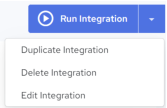

## View Integration Details

To view integrations

1. Click the Integrations link at the top of the page.

    The Integration Designs page displays the available integrations.

2. Click the desired Integration.

    The Integration details page is displayed.

3. You can view and edit the integration details from this page.

    The following information is displayed for the integration:

| Properties | Editable | Description |
| --- | --- | --- |
| Integration name | Yes | The Integration name. Hover over the integration name and a pencil icon appears. Click the name or click the pencil icon to edit the integration name. Clickto save your changes and click to clear and close the edit box. |
| Description | Yes | The description text. Hover over the description text and a pencil icon appears. Click the description text or click the pencil icon to edit the description. Clickto save your changes and click to clear and close the edit box. |
| Source | Yes | Data source for the integration. Click  to edit the source. See [Define Source](../Integrations/Define_Source.md). |
| Target | Yes | Target for the integration. Click  to edit the target. See [Define Target](../Integrations/Define_Target.md) |
| Scheduling | Yes | Displays the run schedule associated with the integration. Possible values are: • On Demand – Unscheduled; the integration must be run manually from the Integration Designs page or the Integration details page. • Interval – Scheduled to run every x hours and x minutes. • Daily – Scheduled to run every x days at a specified time. • Weekly – Scheduled to run every week at a specified time on a specific day. • Monthly – Scheduled to run every month on a specific day every x months at a specified time. • Custom – Scheduled to run as per the specified schedule frequency. • Custom CRON Expression – Specify a cron expression using the Quartz Scheduler to schedule the job run. If necessary, please reference a [quick cron expression tutorial](https://www.quartz-scheduler.org/documentation/quartz-2.3.0/tutorials/crontrigger.html) provided by Quartz.Click  to change the run schedule. See [Edit Integration Schedule](../Integrations/Edit_Integration_Schedule.md). |
| Owner | No | Displays the integration owner email ID. The default owner is the creator. |
| Change Log | Yes | Displays the created date and modified dates for the integration. |

    Integration details page options and actions:

| Options | Description |
| --- | --- |
|  | A Run Integration button is displayed on the page. If clicked, the current Integration is executed immediately.The down arrow control next to the Run Integration button will expose a set of execution options for the current integration. You can choose from the following actions: • Duplicate Integration – Click this option to duplicate the current integration. See [Duplicate Integration](../Integrations/Duplicate_Integration.md). • Delete Integration – Click this option to delete the current integration. See [Delete Integration](../Integrations/Delete_Integration.md). • Edit Integration– Click this option to delete the current integration. See [Edit Integration](../Integrations/Edit_Integration.md). |

!!! warning "Important"

    **IMPORTANT!**When using an Agent to run an integration with Actian Warehouse as the target, make sure the IP address of the host machine where the Agent is installed is added to the Warehouse's allowed IP list. Without this, the integration will not run. See [Update Allow List IP Addresses](../User/UpdateAllowListIPs.md).
