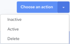

## View Templates

To view the template list

1. Click Integrations, Manage, Templates.

    The Templates page is displayed, listing available integration templates.

2. Click one of the following tabs to reorganize the template list:

    - All – Displays all templates

    - Recent – Displays recently created templates

    - Favorites – Displays templates that were set as favorites.

The template list displays the following information:

| Column Name | Description |
| --- | --- |
| Template | Name of the template. Clicking the Name header sorts the list in ascending or descending alphabetical order. |
| Owner | User who created the template. Clicking on the icon displays the username of the user. |
| Created | Date the template was created. Clicking the Created header sorts the templates list in ascending or descending date/time order. |
| Modified | Date the file was last modified. Clicking the Modified header sorts the templates list in ascending or descending date/time order. |
| Active | Indicates whether the template is Active or Inactive. For more information, see [Set a Template to Active or Inactive](../Integrations/Set_a_Template_to_Active_or_Inactive.md). |

The Templates page options and actions:

| Options and Actions | Description |
| --- | --- |
|  | Click this icon and specify the value that you want to search. The values in each column will be evaluated during the search. Contents will be filtered based on the search string.Click  to close the search box. |
|  | To filter listed templates by Active or Inactive status, click this icon and select the status you want to list.Click  to close the filter options |
|  | Click the down arrow and select how many records to display on the page. The default page size is set to 25. |
|  | Use these options to Navigate from one page to another. |
|  | This button is displayed when you select a template by clicking the check box that is displayed next to the template name. Choose from the following set of actions:•INACTIVE – Set the selected template to Inactive. See [Set a Template to Active or Inactive](../Integrations/Set_a_Template_to_Active_or_Inactive.md).•ACTIVE – Set the selected template to Active. See [Set a Template to Active or Inactive](../Integrations/Set_a_Template_to_Active_or_Inactive.md).•DELETE – Delete the selected template. See [Delete a Template](../Integrations/Delete_a_Template.md). |
| Create Template | Click this to create a template. See [Creating Templates](../Integrations/Creating_Templates.md). |
