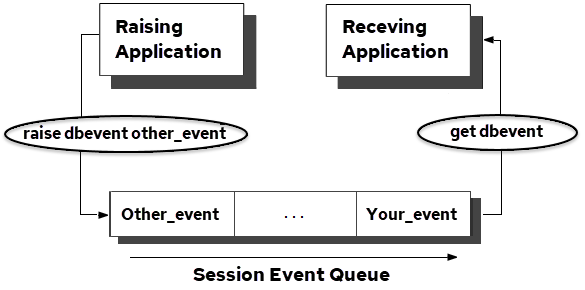

## Database Event Statements

Database events use the following SQL statements:

- CREATE DBEVENT
- RAISE DBEVENT

- REGISTER DBEVENT
- GET DBEVENT

- REMOVE DBEVENT
- DROP DBEVENT

- INQUIRE_SQL
- SET_SQL

- GRANT...ON DBEVENT
- HELP PERMIT ON DBEVENT

### Create a Database Event

To create a database event, use the CREATE DBEVENT statement:

```
CREATE DBEVENT event_name
```

**event_name**

:   Is a unique database event name and a valid object name.

Database events for which appropriate permissions have been granted (RAISE or REGISTER) can be raised by all applications connected to the database and received by all applications connected to the database and registered to receive the database event.

If a database event is created from within a transaction and the transaction is rolled back, creation of the database event is also rolled back.

### Raise a Database Event

To raise a database event, use the RAISE DBEVENT statement:

```
RAISE DBEVENT event_name [event_text] [WITH [NO]SHARE]
```

The RAISE DBEVENT statement can be issued from interactive or embedded SQL applications, or from within a database procedure. When the RAISE DBEVENT statement is issued, Thge Actian Data Platform sends a database event message to all applications that are registered to receive event_name. If no applications are registered to receive a database event, raising the database event has no effect.

A session can raise any database event that is owned by the effective user of the session, and any database event owned by another user who has granted the raise privilege to the effective user, group, role, or public.

The optional event_text parameter is a string (maximum 256 characters) that can be used to pass information to receiving applications. For example, you can useevent_text to pass the name of the application that raised the database event, or to pass diagnostic information.

The [NO]SHARE parameter specifies whether the Actian Data Platform issues database event messages to all applications registered for the database event, or only to the application that raised the database event. If SHARE is specified or omitted, the Actian Data Platform notifies all registered applications when the database event is raised. If NOSHARE is specified, the Actian Data Platform notifies only the application that issued the query that raised the database event (assuming the program was also registered to receive the database event).

If a transaction issues the RAISE DBEVENT statement, and the transaction is subsequently rolled back, database event queues are not affected by the rollback: the raised database event remains queued to all sessions that registered for the database event.

### Register Applications to Receive a Database Event

To register an application to receive database events, use the REGISTER DBEVENT statement:

```
REGISTER DBEVENT event_name
```

**event_name**

:   Specifies an existing database event.

Sessions must register for each database event to be received. A session can register for all database events that the session’s effective user owns, and all database events for which the effective user, group, role, or public has been granted REGISTER privilege. For each database event, the registration is in effect until the session issues the REMOVE DBEVENT statement or disconnects from the database.

Actian Data Platform issues an error if:

- A session attempts to register for a non-existent database event
- A session attempts to register for a database event for which the session does not have register privilege

- A session attempts to register twice for the same database event. If the REGISTER DBEVENT statement is issued from within a transaction that is subsequently rolled back, the registration is not rolled back.

The REGISTER DBEVENT statement can be issued from interactive or embedded SQL, or from within a database procedure.

### How a Database Event Is Received

To receive a database event and its associated information, an application must perform two steps:

1. Remove the next database event from the session’s database event queue using GET DBEVENT or, implicitly, using WHENEVER DBEVENT or SET_SQL(DBEVENTHANDLER).
2. Inquire for database event information using INQUIRE_SQL.

### Get a Database Event

To get the next database event, if any, from the queue of database events that have been raised and for which the application session has registered, use the GET DBEVENT statement:

```
EXEC SQL GET DBEVENT [WITH NOWAIT | WAIT [= wait_value]];
```

The following illustration shows how the GET DBEVENT statement works:



GET DBEVENT returns database events for the current session only; if an application runs multiple sessions, each session must register to receive the desired database events, and the application must switch sessions to receive database events queued for each session.

The optional WITH clause specifies whether your application waits for a database event to arrive in the queue. If GET DBEVENT WITH WAIT is specified, the application waits indefinitely for a database event to arrive. If GET DBEVENT WITH WAIT=wait_value is specified, the application waits the specified number of seconds for a database event to arrive. If no database event arrives in the specified time period, the GET DBEVENT statement times out, and no database event is returned. If GET DBEVENT WITH NOWAIT is specified, the Actian Data Platform checks for a database event and returns immediately. The default is NOWAIT.

The WITH WAIT clause cannot be specified if the GET DBEVENT statement is issued in a select loop or user-defined error handler.

To obtain database event information, your application must issue the INQUIRE_SQL statement, and specify one or more of the following parameters:

- **DBEVENTNAME** – The name of the database event (in lowercase letters). If there are no database events in the database event queue, the Actian Data Platform returns an empty string (or a string containing blanks, if your host language uses blank-padded strings).
- **DBEVENTOWNER** – The username of the user that created the database event; returned in lowercase letters.

- **DBEVENTDATABASE** – The database in which the database event was raised; returned in lowercase letters.
- **DBEVENTTIME** – The date and time the database event was raised, in date format. The receiving host variable must be a string (minimum length of 25 characters).

- **DBEVENTTEXT** – The text, if any, specified in the optional event_text parameter by the application that raised the database event. The receiving variable must be a 256‑character string. If the receiving variable is too small, the text is truncated.

### How to Process Database Events

Three methods can be used to process database events:

- The GET DBEVENT statement is used to explicitly consume each database event from the database event queue of the session. Typically, a loop is constructed to poll for database events and call routines that appropriately handle different database events. GET DBEVENT is a low-overhead statement: it polls the application’s database event queue and not the server.
- Trap database events using the WHENEVER DBEVENT statement. To display database events and remove them from the database event queue, specify WHENEVER DBEVENT SQLPRINT. To continue program execution without removing database events from the database event queue, specify WHENEVER DBEVENT CONTINUE. To transfer control to a database event handling routine, specify WHENEVER DBEVENT GOTO or WHENEVER DBEVENT CALL. To obtain the database event information, the routine must issue the INIQUIRE_SQL statement.

- Trap database events to a handler routine, using SET_SQL DBEVENTHANDLER. To obtain the database event information, the routine must issue the INQUIRE_SQL statement.

!!! note "Note"

    If your application terminates a select loop using the ENDSELECT statement, unread database events must be purged.

Database events (dbevents) are received only during communication between the application and the Actian Data Platform while performing SQL query statements. When notification is received, the application programmer must ensure that all database events in the database events queue are processed by using the GET DBEVENT loop, which is described below.

### Get Dbevent Statement Example

The following example shows a loop that processes all database events in the database event queue. The loop terminates when there are no more database events in the queue.

```
loop
```

```
     exec sql get dbevent;     exec sql inquire_sql (:event_name =          dbeventname);      if event_name = 'event_1'           process event 1      else      if event_name = 'event_2'          process event 2      else           ...      endif until event_name = ''
```

### Whenever Dbevent Statement

To use the WHENEVER DBEVENT statement, your application must include an SQLCA. When a database event is added to the database event queue, the SQLCODE variable in the SQLCA is set to 710 (also the standalone SQLCODE variable is set to 710; SQLSTATE is not affected). However, if a query results in an error that resets SQLCODE, the WHENEVER statement does not trap the database event. The database event is still queued, and your error-handling code can use the GET DBEVENT statement to check for queued database events.

To avoid inadvertently (and recursively) triggering the WHENEVER mechanism from within a routine called as the result of a WHENEVER DBEVENT statement, your database event-handling routine must turn off trapping:

```
main program:exec sql whenever dbevent call event_handler;...event_handler:/* turn off the whenever event trapping */     exec sql whenever dbevent continue;exec sql inquire_sql(:evname=dbeventname...);process eventsreturn
```

### User-Defined Database Event Handlers

To define your own database event-handling routine, use the EXEC SQL SET_SQL(DBEVENTHANDLER) statement. This method traps database events as soon as they are added to the database event queue; the WHENEVER method must wait for queries to complete before it can trap database events.

### Remove a Database Event Registration

To remove a database event registration, use the REMOVE DBEVENT statement:

```
REMOVE DBEVENT event_name
```

**event_name**

:   Specifies a database event for which the application has previously registered.

After a database event registration is removed, the Actian Data Platform does not notify the application when the specified database event is raised. (Pending database event messages are not removed from the database event queue.) When attempting to remove a registration for a database event that was not registered, the Actian Data Platform issues an error.

### Drop a Database Event

To drop a database event, use the DROP DBEVENT statement:

```
DROP DBEVENT event_name
```

whereevent_name is a valid and existing database event name. Only the user that created a database event can drop it.

After a database event is dropped, it cannot be raised, and applications cannot register to receive the database event. (Pending database event messages are not removed from the database event queue.)

If a database event is dropped while applications are registered to receive it, the database event registrations are not dropped from the Actian Data Platform until the application disconnects from the database or removes its registration for the dropped database event. If the database event is recreated (with the same name), it can again be received by registered applications.

### Privileges and Database Events

The raise privilege is required to raise database events, and the register privilege is required to register for database events. To grant these privileges, use the GRANT statement:

```
GRANT RAISE ON DBEVENT event_name TO
```

```
GRANT REGISTER ON DBEVENT event_name TO
```

To revoke these privileges, use the REVOKE statement. To display the number for the raise or register privileges, use the HELP PERMIT statement. To display the permits defined for a specific database event, use the following statement:

```
HELP PERMIT ON DBEVENT event_name{, event_name}
```

### Trace Database Events

The following features enable your application to display and trace database events:

- To enable or disable the display of database event trace information for an application when it raises a database event, SET [NO]PRINTDBEVENTS statement.

    To enable the display of database events as they are raised by the application, specify set PRINTDBEVENTS. To disable the display of database events, specify SET NOPRINTDBEVENTS.

- To enable or disable the logging of raised database events to the installation log file, use the SET [NO]LOGDBEVENTS statement:

    To enable the logging of database events as they are raised by the application, specify SET LOGDBEVENTS. To disable the logging of database events, specify SET NOLOGDBEVENTS.

- To enable or disable the display of database events as they are received by an application, use the EXEC SQL SET_SQL(DBEVENTDISPLAY = 1| 0 | variable)

    Specify a value of 1 to enable the display of received database events, or 0 to disable the display of received database events. This feature can also be enabled by using II_EMBED_SET.

- A routine can be created that traps all database events returned to an embedded SQL application. To enable or disable a database event-handling routine or function, your embedded SQL application must issue the EXEC SQL SET_SQL(DBEVENTHANDLER = event_routine | 0) statement.

    To trap database events to your database event-handling routine, specify event_routine as a pointer to your error-handling function. Before using the SET_SQL statement to redirect database event handling, create the database event-handling routine, declare it, and link it with your application.
