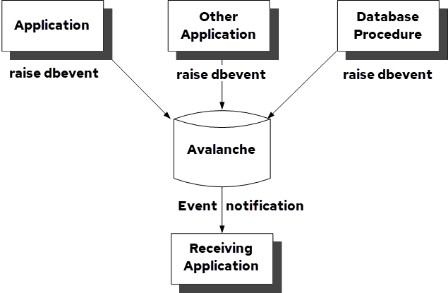

## Database Events

Database events enable an application or the Actian Data Platform to notify other applications that a specific event has occurred. An event is any occurrence that your application program is designed to handle.

The following diagram illustrates a typical use of database events: various applications or database procedures raise database events, and the Actian Data Platform notifies a monitor (receiving) application that is registered to receive the database events. The monitor application responds to the database events by performing the actions the application designer specified when writing the monitor application.

Database events can be raised by any of the following entities:

- An application that issues the RAISE DBEVENT statement
- An application that executes a database procedure that issues the RAISE DBEVENT statement
