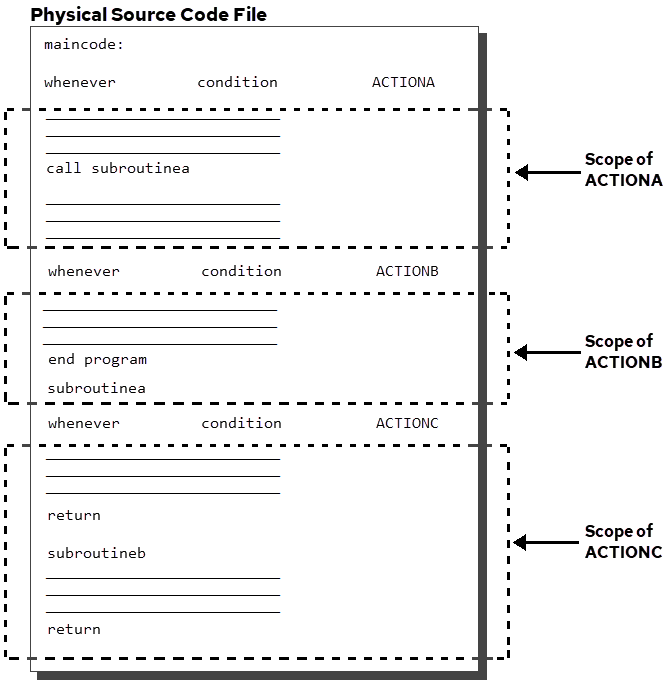

## Error Handling in Embedded Applications

SQL provides a variety of tools for trapping and handling errors in embedded SQL applications, including:

- SQLCA
- SQLSTATE

- The WHENEVER statement
- Handler routines

- INQUIRE statements
- The IIseterr() function

### Error Information from SQLCA

The SQL Communications Area (SQLCA) is a collection of host language variables whose values provide status and error information about embedded SQL database statements. (The status of forms statements is not returned in SQLCA variables.) If your application does not have an SQLCA, the default is to display errors and continue with the next statement if possible.

Two variables in the SQLCA contain error information: sqlcode and sqlerrm. The value in sqlcode indicates one of three conditions:

**Success**

:   Sqlcode contains a value of zero.

**Error**

:   Sqlcode contains the error number as a negative value.

**Warning**

:   Set when the statement executed successfully but an exceptional condition occurred. Sqlcode contains either +100, indicating that no rows were processed by a DELETE, FETCH, INSERT, UPDATE, MODIFY, COPY, or CREATE TABLE AS SELECT statement, or +700, indicating that a MESSAGE statement inside a database procedure has just executed.

The sqlerrm variable is a varying length character string variable that contains the text of the error message. The maximum length of sqlerrm is 70 bytes. If the error message exceeds that length, the message is truncated when it is assigned to sqlerrm. To retrieve the full message, use the INQUIRE_SQL statement. In some host languages, this variable has two parts: sqlerrml, a 2-byte integer indicating how many characters are in the buffer, and sqlerrmc, a 70-byte fixed length character string buffer.

The SQLCA also contains eight 1-byte character variables, sqlwarn0 - sqlwarn7, that are used to indicate warnings. For a complete listing of these variables, see the table titled SQLCA Variables.

The SQLCA is often used in conjunction with the WHENEVER statement, which defines a condition and an action to take whenever that condition is true. The conditions are set to true by values in the sqlcode variable. For example, if sqlcode contains a negative error number, the sqlerror condition of the WHENEVER statement is true, and any action specified for that condition is performed. For more information, see [Error Trapping Using WHENEVER Statement](../SQLLanguage/Error_Handling_in_Embedded_Applications.md).

The SQLCA variables can also be accessed directly.

### SQLSTATE

SQLSTATE is a variable in which the DBMS returns error codes as prescribed by the ANSI/ISO Entry SQL-92 standard.

### Error Trapping Using WHENEVER Statement

The WHENEVER statement specifies an action to be performed whenever a condition is true. Because conditions are set to true by values in the SQLCA sqlcode, the WHENEVER statement responds only to errors generated by embedded SQL database statements. Forms statements do not set sqlcode.

The following conditions indicate errors or warnings:

| Warnings/Error | Explanation |
| --- | --- |
| sqlwarning | Indicates that the executed SQL database statement produced a warning condition. Sqlwarning becomes true when the SQLCA sqlwarn0 variable is set to W. |
| sqlerror | Indicates that an error occurred in the execution of the database statement. Sqlerror becomes true when the SQLCA sqlcode variable contains a negative number. |

For a complete discussion of all the conditions, see [WHENEVER](../SQLLanguage/WHENEVER.md).

The actions that can be specified for these conditions are listed in the following table:

| Action | Explanation |
| --- | --- |
| continue | Execution continues with the next statement. |
| stop | Prints an error message and terminates the program’s execution. Pending updates are not committed. |
| goto label | Performs a host language go to. |
| call procedure | Calls the specified host language procedure. If call sqlprint is specified, a standard sqlprint procedure is called. This procedure prints the error or warning message and continues with the next statement. A database procedure cannot be specified. |

In an application program, a WHENEVER statement is in effect until the next WHENEVER statement (or the end of the program). For example, if you put the following statement in your program:

```
exec sql whenever sqlerror call myhandler;
```

the DBMS traps errors for all database statements in your program that (physically) follow the WHENEVER statement, to the “myhandler” procedure. A WHENEVER statement does not affect the statements that physically precede it.

The following diagram illustrates the scope of the WHENEVER statement:



If your program includes an SQLCA, error and database procedure messages are not displayed unless your application issues a WHENEVER...SQLPRINT statement, or II_EMBED_SET is set to sqlprint.

### How to Define an Error-Handling Function

You can define an error-handling function to be called when SQL errors occur.

To define an error-handling function, follow these steps:

1. Write the error-handling routine and link it into your embedded SQL application.
2. In the application, issue the following SET statement:

```
exec sql set_sql(errorhandler = error_routine);
```

    where

    error_routine is the name of the error-handling routine that was created. Do not declareerror_routine in an SQL declare section, and do not precede error_routine with a colon; theerror_routine argument must be a function pointer.

    All SQL errors are trapped to your routine until error trapping is disabled (or until the application terminates). Forms errors are not trapped.

To disable the trapping of errors to your routine, your application must issue the following SET statement:

```
exec sql set_sql(errorhandler = 0 | error_var)
```

where error_var is a host integer variable having a value of 0.

Your error-handling routine must not issue any database statements in the same session in which the error occurred. If it is necessary to issue database statements in an error handler, open or switch to another session.

To obtain error information, your error-handling routine must issue the INQUIRE_SQL statement.

### Event Handlers and Message Handlers

In addition to error-handling routines, routines can be defined that enable embedded SQL applications to trap the following:

**Event notifications:**

:   To enable or disable an event-handling routine, issue the following SET_SQL statement:

```
exec sql set_sql(dbeventhandler = event_routine | 0)
```

:   When an event notification is received by your application, the specified routine is automatically called. To obtain the event notification information, the event handler routine must use the INQUIRE_SQL statement.

**Messages from database procedures:**

:   To enable or disable a message handling routine, issue the following SET_SQL statement:

```
exec sql set_sql(messagehandler = message_routine | 0)
```

:   The message handler routine traps all messages from database procedures, including messages from procedures that are executed when rules are fired.

:   Specify the routine as a function pointer.

### Error Checking Using Inquire Statements

The inquire statements that can be used to perform error checking are:

INQUIRE_SQL and INQUIRE_FRS

Both statements return error numbers and messages using the constants errorno and errortext. INQUIRE_SQL returns the error number and text for the last executed SQL database statement. INQUIRE_FRS returns the same information about the last executed forms statement. Unlike the WHENEVER statement, an inquire statement must be executed immediately after the database or forms statement in question. By default, INQUIRE_SQL(ERRORNO) returns a generic error number, but the SET_SQL statement can be used to specify that local errors are returned. For a discussion of local and generic errors, see [Types of Error Codes](../SQLLanguage/Types_of_Error_Codes.md).

Neither of the inquire statements suppress the display of error messages. Both inquire statements return a wide variety of information in addition to error numbers and text.
