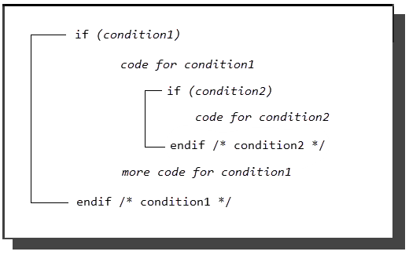

## IF - THEN - ELSE

[Valid in](../SQLLanguage/Statement_Contexts_(Valid_in).md): DBProc

The IF-THEN-ELSE statement chooses between alternate execution paths inside a database procedure.

The IF-THEN-ELSE statement has the following format:

```
IF boolean_expr THEN statement; {statement;}
```

```
              {ELSEIF boolean_expr THEN statement; {statement;}}
```

```
              [ELSE statement;{statement;}]
```

```
ENDIF
```

#### Description

The IF-THEN-ELSE statement can only be issued from within the body of a database procedure.

A Boolean expression (boolean_expr) must always evaluate to true or false. A Boolean expression can include comparison operators ('=', '<>', and so on) and the logical operators and, or, not. Boolean expressions involving nulls can evaluate to unknown. Any Boolean expression whose result is unknown is treated as if it evaluated to false.

If an error occurs during the evaluation of an if statement condition, the database procedure terminates and control returns to the calling application. This is true for both nested and non-nested if statements.

#### Permissions

This statement is available to all users.

### If Statement

The simplest form of the IF statement performs an action if the Boolean expression evaluates to true. The syntax follows:

```
IF boolean_expr THEN       statement; {statement;}ENDIF
```

If the Boolean expression evaluates to true, the list of statements is executed. If the expression evaluates to false (or unknown), the statement list is not executed and control passes directly to the statement following the ENDIF statement.

### If...Then Statement

The second form of the IF statement includes the ELSE clause. The syntax follows:

```
IF boolean_expr THEN       statement; {statement;}ELSE        statement; {statement;}ENDIF
```

In this form, if the Boolean expression is true, the statements immediately following the keyword THEN are executed. If the expression is false (or unknown), the statements following the keyword ELSE are executed. In either case, after the appropriate statement list is executed, control passes to the statement immediately following ENDIF.

### If...Then...Elseif Statement

The third IF variant includes the ELSEIF clause. The ELSEIF clause allows the application to test a series of conditions in a prescribed order. The statement list corresponding to the first true condition found is executed and all other statement lists connected to conditions are skipped. The ELSEIF construct can be used with or without an ELSE clause, which must follow all the ELSEIF clauses. If an ELSE clause is included, one statement list is guaranteed to be executed, because the statement list connected to the ELSE is executed if all the specified conditions evaluate to false.

The simplest form of this variant is:

```
IF boolean_expr THEN       statement; {statement;}ELSEIF boolean_expr THEN       statement; {statement;}ENDIF
```

If the first Boolean expression evaluates to true, the statements immediately following the first THEN keyword are executed. In such a case, the value of the second Boolean expression is irrelevant. If the first Boolean expression proves false, however, the next Boolean expression is tested. If the second expression is true, the statements under it are executed. If both Boolean expressions test false, neither statement list is executed.

A more complex example of the ELSEIF construct is:

```
IF boolean_expr THEN       statement; {statement;}ELSEIF boolean_expr THEN       statement; {statement;}ELSEIF boolean_expr THEN       statement; {statement;}ELSE        statement; {statement;}ENDIF
```

In this case, the first statement list is executed if the first Boolean expression evaluates to true. The second statement list is executed if the first Boolean expression is false and the second true. The third statement list is executed only if the first and second Boolean expressions are false and the third evaluates to true. Finally, if none of the Boolean expressions is true, the fourth statement list is executed. After any of the statement lists is executed, control passes to the statement following the ENDIF.

### Nesting IF Statements

Two or more IF statements can be nested. In such cases, each IF statement must be closed with its own ENDIF.

This example illustrates nested IF statements in outline form:


