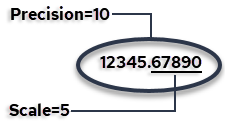
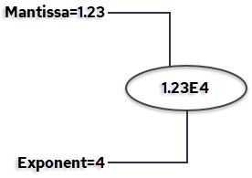

# SQL Data Types

## Data Types

The following data types are supported:

| Class | Data Type | Description |
| --- | --- | --- |
| Character | CHAR | `CHAR(size)`Fixed-length character string having maximum length sizebytes. |
|  | VARCHAR | `VARCHAR(size)`Variable-length character string having maximum length sizebytes. |
|  | NCHAR | `NCHAR(size)`Fixed length Unicode string having maximum length sizecharacters. |
|  | NVARCHAR | `NVARCHAR(size)`Variable-length Unicode string having maximum length sizecharacters. |
| Numeric | INTEGER1 | `INTEGER1``TINYINT`Exact number that requires one byte. |
|  | INTEGER2 | `INTEGER2``SMALLINT`Exact number that requires two bytes. |
|  | INTEGER4 | `INTEGER4``INTEGER`Exact number that requires four bytes. |
|  | INTEGER8 | `INTEGER8``BIGINT`Exact number that requires eight bytes. |
|  | DECIMAL | `DECIMAL(p,s)`Exact numeric type with precision pand scale s. |
|  | FLOAT | `FLOAT[(n)]``FLOAT8[(n)]`Approximate number that requires eight bytes with optional minimum required binary precision of n(24 to 53). |
|  | FLOAT4 | `FLOAT4[(n)]`Approximate number that requires four bytes with optional minimum required binary precision of n (0 to 23). |
| Date and time | ANSIDATE | `ANSIDATE`Year, month, day in the format yyyy-mm-dd. |
|  | TIME WITHOUT TIME ZONE | `TIME[(n)]`Hour, minutes, seconds with ndigits of precision in the fractions of seconds. |
|  | TIME WITH TIME ZONE | `TIME[(n)] WITH TIME ZONE`Hour, minutes, seconds with ndigits of precision in the fractions of seconds, at the specified time zone. |
|  | TIME WITH LOCAL TIME ZONE | `TIME[(n)] WITH LOCAL TIME ZONE`Hour, minutes, seconds with ndigits of precision in the fractions of seconds, in local time zone. |
|  | TIIMESTAMP WITHOUT TIME ZONE | `TIMESTAMP[(n)]`Year, month, day, time with ndigits of precision in the fractions of seconds. |
|  | TIMESTAMP WITH TIME ZONE | `TIMESTAMP[(n)] WITH TIME ZONE`Hour, minutes, seconds with ndigits of precision in the fractions of seconds, at the specified time zone. |
|  | TIMESTAMP WITH LOCAL TIMEZONE | `TIMESTAMP[(n)] WITH LOCAL TIME ZONE`Hour, minutes, seconds with ndigits of precision in the fractions of seconds, in local time zone. |
|  | INTERVAL YEAR TO MONTH | `INTERVAL YEAR TO MONTH`An interval of years and months. |
|  | INTERVAL DAY TO SECOND | `INTERVAL DAY TO SECOND[(n)]`An interval of days and seconds with ndigits of precision in the fractions of seconds. |
| Abstract | MONEY | `MONEY`Monetary amount in the range -999,999,999,999.99 to 999,999,999,999.99 |
|  | IPV4 | `IPV4`An IPv4 host address.4-byte, network address in dotted-decimal notation (four decimal numbers, each ranging from 0 to 255, separated by dots). For example: 172.16.254.1 |
|  | IPV6 | `IPV6`An IPv6 host address.16-byte, network address in eight groups of four hexadecimal digits separated by colons. For example: 2001:0db8:85a3:0042:1000:8a2e:0370:7334 |
|  | UUID | `UUID`A unique 128-bit integer. |
| Boolean | BOOLEAN | `BOOLEAN`Literal values TRUE or FALSE, strings 'TRUE' or 'FALSE' |

## Char Data Type

Char strings are fixed-length strings. Char strings can contain any printing or non-printing character, except the null character ('\0').

In uncompressed tables, char strings are padded with blanks to the declared length. For example, if ABC is entered into a char(5) column, five bytes are represented, as follows:

```
'ABC  '
```

Leading and embedded blanks are significant when comparing char strings. For example, the following char strings are considered different:

```
'A B C''ABC'
```

When selecting char strings using the underscore (_) wildcard character of the LIKE predicate, include any trailing blanks to be matched. For example, to select the following char string:

```
'ABC '
```

the wildcard specification must also contain trailing blanks:

```
'_____'
```

Length is not significant when comparing char strings; the shorter string is (logically) padded to the length of the longer. For example, the following char strings are considered equal:

```
'ABC''ABC '
```

!!! note "Note"

    A synonym for char is character.

## Varchar Data Type

Varchar strings are variable-length strings. Varchar strings can contain any character, including non-printing characters, except the ASCII null character ('\0').

If the column is nullable, varchar columns require an additional byte of storage.

Blanks are significant in the varchar data type. For example, the following two varchar strings are not considered equal:

```
'the store is closed'
```

and

```
'thestoreisclosed'
```

If the strings being compared are unequal in length, the shorter string is padded with trailing blanks until it equals the length of the longer string.

For example, consider the following two strings:

```
'abcd\001'
```

where:

'\001' represents one ASCII character (ControlA)

and

```
'abcd'
```

If they are compared as varchar data types, then

```
'abcd' > 'abcd\001'
```

because the blank character added to 'abcd' to make the strings the same length has a higher value than ControlA ('\040' is greater than '\001').

## Nchar Data Type

Actian stores all character data in UTF8 so the nchar data type is equivalent to the char data type.

## Nvarchar Data Type

Actian stores all character data in UTF8 so the nvarchar data type is equivalent to the varchar data type.

## Integer Data Types

Exact numeric data types include the following integer data types:

- INTEGER1 or TINYINT (one-byte)
- INTEGER 2 or SMALLINT (two-byte)

- INTEGER4 or INTEGER (four-byte)
- INTEGER8 or BIGINT (eight-byte)

The following table lists the ranges of values for each integer data type:

| Integer Data Type | Lowest Possible Value | Highest Possible Value |
| --- | --- | --- |
| INTEGER1 | -128 | +127 |
| INTEGER2 | -32,768 | +32,767 |
| INTEGER4 | -2,147,483,648 | +2,147,483,647 |
| INTEGER8 | -9,223,372,036,854,775,808 | +9,223,372,036,854,775,807 |

## Decimal Data Type

The decimal data type is an exact numeric data type defined by its precision (total number of digits) and scale (number of digits to the right of the decimal point). For example:



!!! note "Note"

    The decimal data type is suitable for storing currency data where the required range of values or number of digits to the right of the decimal point exceeds the capacities of the money data type. For display purposes, a currency sign cannot be specified for decimal values.

Specify the decimal data type using the following syntax:

```
decimal(p,s)
```

where:

**p**

:   Defines the precision. Minimum is 1; maximum is 38.

**s**

:   Defines the scale. The scale of a decimal value cannot exceed its precision. Scale can be 0 (no digits to the right of the decimal point).

!!! note "Note"

    Synonyms for the decimal data type are dec and numeric.

The following defines a type with precision of 23 decimal digits, 5 of which are after the decimal point:

```
DECIMAL(23,5)
```

## Floating Point Data Types

A floating point value is represented either as whole plus fractional digits (like decimal values) or as a mantissa plus an exponent.

The following is an example of the mantissa and exponent parts of floating point values:



There are two floating point data types:

- FLOAT4 (4-byte)
- FLOAT (8-byte)

A synonym for FLOAT4 is REAL. Synonyms for FLOAT are FLOAT8 and DOUBLE PRECISION.

Floating point numbers are stored in four or eight bytes. Internally, eight-byte numbers are rounded to fifteen decimal digits. The precision of four-byte numbers is processor dependent.

You can specify the minimum required binary precision (number of significant bits) for a floating point value using the following optional syntax:

```
FLOAT(n)
```

where n is a value from 0 to 53. Storage is allocated based on the precision that is specified, as follows:

| Range of Binary Precision | Storage Allocated | Example |
| --- | --- | --- |
| 0 to 23 | 4-byte float | float(18) defines a floating point type with at least 18 binary digits of precision in the mantissa. A 4‑byte floating point field is allocated for it, which has 23 bits of precision. |
| 24 to 53 | 8-byte float | float(41) defines a floating point type with at least 41 binary digits of precision in the mantissa. A 8‑byte floating point field is allocated for it, which has 53 bits of precision. |

Floating point precision is not limited to the declared size.

### Float Point Limitations

You must consider the effects of data type conversions when numeric values are combined or compared. This is especially true when dealing with floating point values.

Exact matches on floating point numbers are discouraged, because FLOAT and FLOAT4 data types are approximate numeric values. In contrast, INTEGER and DECIMAL data types are exact numeric values.

Here is an example of why it is hard to find an exact match on a floating point number:

```
test(f8 FLOAT8);
```

```
INSERT INTO test VALUES(330/11.0);
```

```
SELECT * FROM test WHERE f8 = 30;
```

returns no rows.

On inspection,

```
SELECT HEX(f8) FROM test;
```

returns:

```
+----------------+
```

```
|col1            |
```

```
+----------------+
```

```
|403E000000000001|
```

```
+----------------+
```

Using an IEEE analyzer we find this number to be decimal 30.000000000000003552713678800500929355621337890625, which, though close to 30, shows why no exact match was found.

To ensure the query returns a row, you can change it to the following:

```
SELECT * FROM test WHERE ABS(f8 - 30) < 0.0000000001
```

## Money Data Type

The MONEY data type is an abstract data type. Money values are stored significant to two decimal places. These values are rounded to their amounts in dollars and cents or other currency units on input and output, and arithmetic operations on the money data type retain two-decimal-place precision.

Money columns can accommodate the following range of values:

$-999,999,999,999.99 to $999,999,999,999.99

A money value can be specified as either:

- A character string literal – The format for character string input of a money value is$sdddddddddddd.dd. The dollar sign is optional and the algebraic sign (s) defaults to + if not specified. There is no need to specify a cents value of zero (.00).
- A number – Any valid integer or floating point number is acceptable. The number is converted to the money data type automatically.

On output, money values display as strings of 20 characters with a default precision of two decimal places. The display format is:

$[-]dddddddddddd.dd

where:

$ is the default currency symbol
dis a digit from 0 to 9

The following settings affect the display of money data.:

| Variable | Description |
| --- | --- |
| II_MONEY_FORMAT | Specifies the character displayed as the currency symbol. The default currency sign is the dollar sign ($). II_MONEY_FORMAT also specifies whether the symbol appears before or after the amount. |
| II_MONEY_PREC | Specifies the number of digits displayed after the decimal point; valid settings are 0, 1, and 2. |
| II_DECIMAL | Specifies the character displayed as the decimal point; the default decimal point character is a period (.). II_DECIMAL also affects FLOAT, FLOAT4, and the DECIMAL data types. |

!!! note "Note"

    If II_DECIMAL is set to comma, you must follow any comma required in SQL syntax (such as a list of table columns or SQL functions with several parameters) by a space. For example:

```
SELECT col1, IFNULL(col2, 0), LEFT(col4, 22) FROM version;
```

## Ansidate Data Type

The ANSIDATE data type consists of a year, month, day. Input and output is in the format yyyy-mm-dd.

The declaration format is as follows:

```
ANSIDATE
```

| Date Format | Input and Output Example |
| --- | --- |
| ANSIDATE | 2006-05-16 |

A synonym for ANSIDATE is DATE.

## Time Data Types

The TIME data type consists of a time in hour, minutes, seconds, optional fractions of a second, and optional time zone.

The format is as follows:

```
TIME [time_precision] [time_zone_spec]
```

**time_precision**

:   (Optional) Indicates the number of digits of precision in the fractions of seconds, as an integer value from 0 to 9. When no time precision is supplied, the value of time_precision is set to 0 by default.

!!! note "Note"

    When a value is entered that exceeds the specified precision, the value is truncated at the specified precision.

**time_zone_spec**

:   (Optional) Specifies a time zone as one of the following:

    - WITH TIME ZONE

    - WITHOUT TIME ZONE

    - WITH LOCAL TIME ZONE

!!! note "Note"

    The time value in TIME WITH TIME ZONE data type indicates the time at the specified time zone.

Examples:

| Time Format | Example |
| --- | --- |
| TIME(5) WITH TIME ZONE | 12:30:55.12345-05:00 |
| TIME(4) WITHOUT TIME ZONE | 12:30:55.1234 |
| TIME(9) WITH LOCAL TIME ZONE | 12:30:55.123456789 |

## Timestamp Data Types

The TIMESTAMP data type consists of a date and time, with optional time zone.

The format is as follows:

```
TIMESTAMP [(timestamp_precision)] [time_zone_spec]
```

**timestamp_precision**

:   (Optional) Indicates the number of digits of precision in the fractions of seconds, as an integer value from 0 to 9. The default is 6.

!!! note "Note"

    When a value is entered that exceeds the specified precision, the value is truncated at the specified precision.

**time_zone_spec**

:   (Optional) Specifies a time zone as one of the following:

    - WITH TIME ZONE

    - WITHOUT TIME ZONE

    - WITH LOCAL TIME ZONE

!!! note "Note"

    The time value in TIMESTAMP WITH TIME ZONE data type indicates the time at the specified time zone.

Examples:

| Timestamp Format | Example |
| --- | --- |
| TIMESTAMP | 2012-12-15 12:30:55.123456 |
| TIMESTAMP(4) WITHOUT TIME ZONE | 2012-12-15 12:30:55.1234 |
| TIMESTAMP(5) WITH TIME ZONE | 2012-12-15 9:30:55.12345-08:00 |
| TIMESTAMP(9) WITH LOCAL TIME ZONE | 2012-12-15 12:30:55.123456789 |

**Note:**Two TIMESTAMP WITH TIME ZONE values are considered identical if they represent the same instant in UTC, regardless of the TIME ZONE offsets stored in the database. For example:

```
TIMESTAMP '2012-12-15 9:30:55 -8:00'
```

is the same as

```
TIMESTAMP '2012-12-15 12:30:55 -5:00'
```

## Interval Data Types

The INTERVAL data types include year to month and day to second intervals.

The format is as follows:

```
INTERVAL interval_qualifier
```

**interval_qualifier**

:   Defines an interval column as one of the following:

    - YEAR TO MONTH

    - DAY TO SECOND [(second_precision)]

    where second_precision is the number of digits in the fractions of seconds field.

!!! note "Note"

    When a value is entered that exceeds the specified precision, the value is truncated at the specified precision.

Examples:

| Interval Format | Example | Explanation |
| --- | --- | --- |
| INTERVAL YEAR TO MONTH | 123-04 | An interval of 123 years, 4 months |
| INTERVAL DAY TO SECOND(3) | 7 6:54:32.123 | An interval of 7 days, 6 hours, 54 minutes, 32 seconds and 123 thousandths of a second |

## Boolean Data Type

BOOLEAN columns accept as input the literal values TRUE and FALSE and the strings 'TRUE' and 'FALSE', with no case sensitivity.

Internally, the BOOLEAN type is stored as a single-byte integer that takes only the values 0 and 1.

## IP Network Address Data Types

IPV4 and IPV6 are abstract data types that store IPv4 and IPv6 host addresses, respectively, in binary format.

IPV4 is a 4-byte host address in dotted-decimal notation (four decimal numbers, each ranging from 0 to 255, separated by dots). For example: 172.16.254.1.

IPV6 is a 16-byte host address in eight groups of four hexadecimal digits separated by colons. For example: 2001:0db8:85a3:0042:1000:8a2e:0370:7334.

We recommend using the IPV4 and IPV6 data types instead of plain text to store network addresses because they provide input error checking and specialized operators and functions.

An IPv4 address can be stored in an IPv6-type value, but the address will be stored as an IPv4-mapped IPv6 address. When coerced to type IPV6, a “pure” IPv4 address cannot be distinguished from a mapped IPv4 address—for example, "192.168.0.1" cannot be distinguished from "::ffff:c0a8:1" or from "::ffff:192.168.0.1".

Comparisons between two IPV4 or two IPV6 values operate like BYTE comparisons (that is, unsigned byte-wise). IPV6 is the “higher” type in mixed expressions.

IPV4 and IPV6 addresses are stored as 4 and 16 bytes, respectively.

!!! note "Note"

    CIDR notation (for example: 192.168.100.0/24) is not supported.

Example input and output:

| IPV4 or IPV6 Input | Output |
| --- | --- |
| 172.16.254.1 | 172.16.254.1 |
| 2001:db8:0:1234:0:567:8:1 | 2001:db8:0:1234:0:567:8:1 |
| 2001:db8:0:0:0:0:0:0 | 2001:db8:: |
| ::ffff:c0a8:1 | 192.168.0.1 |

## Universal Unique Identifier (UUID)

A Universal Unique Identifier (UUID) is a 128 bit, unique identifier generated by the local system upon request or loaded from external sources.

The database can generate UUID values with the uuid() function. Existing UUID values can be loaded from external sources; the data type is coerced, if necessary. The system cannot guarantee uniqueness of these external values, but when used correctly, the algorithms used to create the values will guarantee it.

The identifier is unique across both space and time with respect to the space of all UUIDs. UUID values generated are Version 1 (time-based) UUIDs.

A UUID can be used to tag records to ensure that the database records are uniquely identified regardless of which database they are stored in, for example, in a system where there are two separate physical databases containing accounting data from two different physical locations.

No centralized authority is responsible for assigning UUIDs. They can be generated on demand (10 million per second per machine if needed).

A UUID can be used for multiple purposes:

- Tagging objects that have a brief life
- Reliably identifying persistent objects across a network

- Assigning as unique values to transactions as transaction IDs in a distributed system

UUIDs are fixed sized (128 bits), which is small relative to other alternatives. This fixed small size lends itself well to sorting, ordering, and hashing of all sorts, sorting in databases, simple allocation, and ease of programming.

## Storage Formats of Data Types

The following table describes how each data type is stored:

| Data Type | Description | Range |
| --- | --- | --- |
| CHAR | character | A string of 1 to maximum configured row size, but not exceeding 16,000 characters (32,000 bytes) |
| VARCHAR | character | A string of 1 to maximum configured row size, but not exceeding 16,000 characters (32,000 bytes) |
| NCHAR | Unicode | See CHAR data type. |
| NVARCHAR | Unicode | See VARCHAR data type. |
| TINYINT | 1-byte integer | -128 to +127 |
| SMALLINT | 2-byte integer | -32,768 to +32,767 |
| INTEGER | 4-byte integer | -2,147,483,648 to +2,147,483,647 |
| BIGINT | 8-byte integer | -9,223,372,036,854,775,808 to +9,223,372,036,854,775,807 |
| DECIMAL | fixed-point exact numeric | Depends on precision and scale. Default is (5,0): -99999 to +99999. Maximum number of digits is 38. |
| FLOAT4 | 4-byte floating | ‑3.402823e+38 to +3.402823+38 (7 digit precision) |
| FLOAT or FLOAT8 | 8-byte floating | -1.0e+308 to 1.0e+308 (15 digit precision) |
| ANSIDATE | 4-byte integer | 0001-01-01 to 9999-12-31 |
| TIME | 2- or 4-byte integer | 00:00:00 to 23:59:59.999999 |
| TIMESTAMP | 8-byte integer | 0001-01-01 00:00:00 to  9999-12-31 23:59:59.999999999 |
| INTERVAL YEAR TO MONTH | 4-byte integer | -9999-11 to 9999-11 |
| INTERVAL DAY TO SECOND | 8-byte integer | -3652047 23:59:59.999999 to  3652047 23:59:59.999999 |
| MONEY | money (8 bytes) | $-999,999,999,999.99 to $999,999,999,999.99 |
| IPV4 | 4-byte binary | 0.0.0.0 to 255.255.255.255 |
| IPV6 | 16-byte binary | :: to ffff:ffff:ffff:ffff:ffff:ffff:ffff:ffff |
| UUID | 128-bit integer | 00000000-0000-0000-0000-000000000000 to FFFFFFFF-FFFF-FFFF-FFFF-FFFFFFFFFFFF |
| BOOLEAN | 1-byte binary | 0 or 1 |

Nullable columns require one additional byte to store a null indicator.

!!! note "Note"

    If your hardware supports the IEEE standard for floating point numbers, the FLOAT type is accurate to 14 decimal precision (-dddddddddddd.dd to +dddddddddddd.dd) and ranges from -10**308 to +10**308. The money type is accurate to 14 decimal precision with or without IEEE support.
