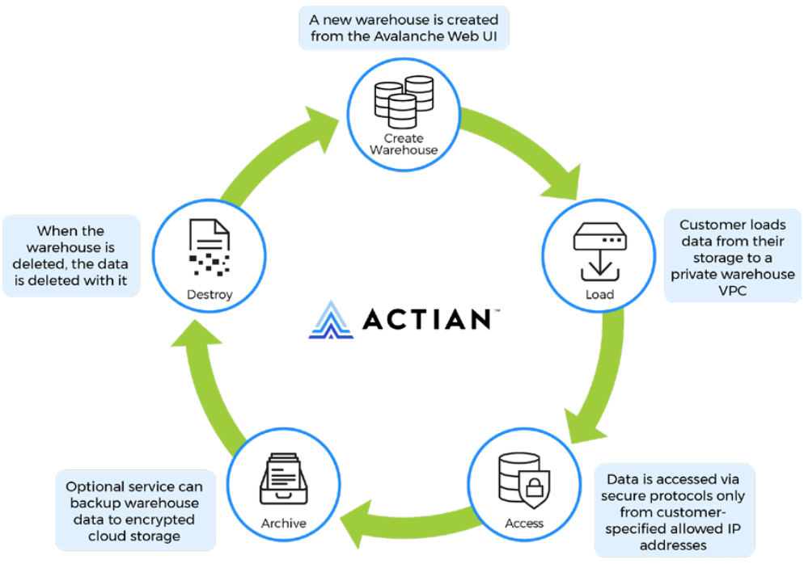

## Data Lifecycle

Here are some commonly asked questions about data in the lifecycle:

**Where is my data?**

:   A warehouse is created from the [Actian Data Platform Warehouses Console](../User/Actian_Data_Platform_Warehouses_Console.md) and loaded from your storage into the Actian Data Platform.

**How is it secured?**

:   Database files are stored on AES-encrypted block storage dedicated to only that data warehouse.

**Who can access my data?**

:   The data is only accessible from the IP addresses in your allow list. For more information, see the [Update Allow List IP Addresses](../User/UpdateAllowListIPs.md).

**How is data accessed?**

:   You can access your data through various standard protocols from the allowed IPs.

**What happens to data when I no longer need it?**

:   When the warehouse is deleted, your data is deleted.
