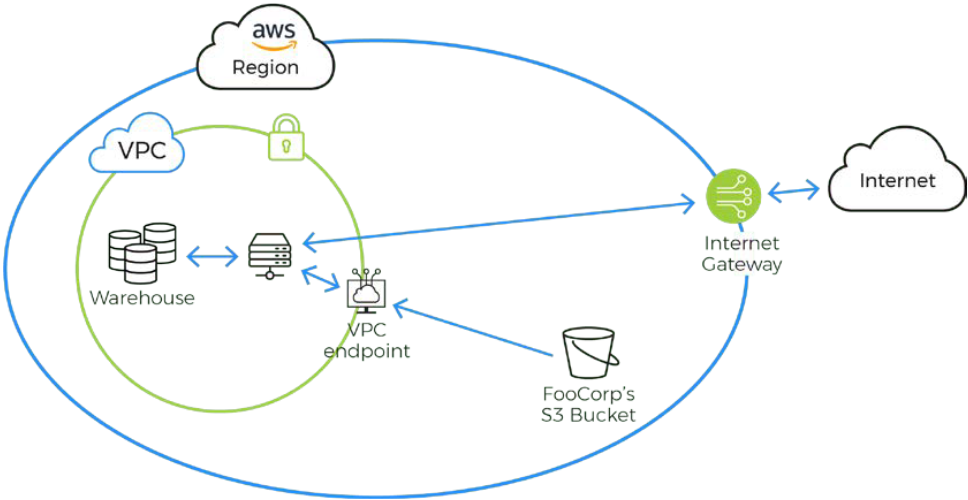

## Storage and Encryption

Actian Data Platform provides industrial grade encryption, including data-at-rest encryption, encryption-in- transit, and an option to encrypt at the block level. Each warehouse is isolated using industry best practices and has no communication with other warehouses (see [The Actian Data Platform Virtual Private Cloud (VPC) Architecture](../Security/The_Actian_Data_Platform_Virtual_Private_Cloud_(.md)).

Internal warehouse traffic does not traverse the Internet. Data is loaded into your warehouse over a secure channel (HTTPS/TLS) from your object storage, for example, Amazon S3. If the cloud object storage and the warehouse are established within the same region, all data transmission is over the cloud as a private channel transfer (currently private channel transfer is AWS only). This data is stored in an optimized format in block storage on the cloud provider.

Google Cloud Storage always encrypts your data on the server side, before it is written to disk, at no additional charge. Cloud Storage encrypts user data-at-rest using AES-256

All data is encrypted in transit during loading and encrypted at rest in the cloud providers’ file system at the storage level. Additionally, customer supplied keys can be used to manage block level encryption within the warehouse (see [Set Up the AWS Key Management Service (AKMS)](../User/Set_Up_the_AWS_Key_Management_Service_(AKMS).md) in the User Guide for more information). Data transmitted to the client from the warehouse is also encrypted. The data warehouse only accepts encrypted connections by default.

Data transmitted to and from the client from the warehouse is also encrypted. The data warehouse only accepts encrypted connections.

Database encryption encrypts the values in columns in tables of the database, including temporary tables at the block level. AES encryption is utilized for all data operations, whether on the DBMS level or user-specified. All encryption functions use randomness as a key component to ensure strong protection of data. Data encryption is transparent and done at the warehouse level.

Access to the [Actian Data Platform Warehouses Console](../User/Actian_Data_Platform_Warehouses_Console.md) (the web UI) is encrypted with TLS and authenticated against an enterprise IdP. The Actian Data Platform console is used to create and delete warehouses and has limited warehouse capabilities. The console cannot access warehouse data. Access to data is provided with the [Query Editor](../User/Part_QueryEditor.md) and the [Actian SQL CLI](../SQLLanguage/Actian_SQL_CLI.md).
