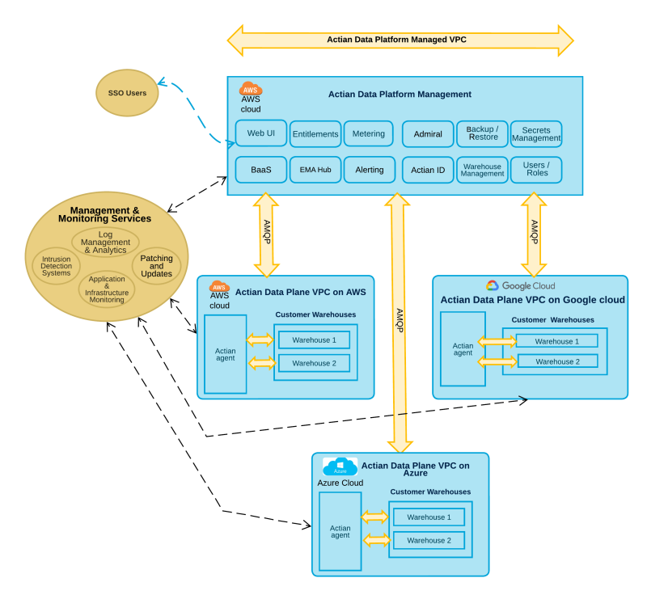

## The Actian Data Platform Virtual Private Cloud (VPC) Architecture

Actian Data Platform consists of a management plane and one or many data planes. This architecture isolates management functionality from the data warehouse level. The management plane can only access warehouse metadata as well as provisioning, management, and monitoring information. Monitoring data relates to warehouse health and performance. Metadata includes warehouse name, creation time, size, region, and so on. Metadata does not contain any customer data.

Warehouses are created in a regional data plane. Each data plane runs in its own VPC where security groups isolate the infrastructure from the internet. Within the data plane, Istio service mesh provides an additional security layer for the components that comprise a warehouse. Calico enforces strict ingress and egress rules to prevent unwanted traffic within the data planes. Warehouses are completely isolated from each other. Inbound warehouse traffic is routed through a public load balancer and restricted to only allow traffic originating from a warehouse's IP allow list. For more information, see [Create a Warehouse](../User/Create_a_Warehouse.md) and [Update Allow List IP Addresses](../User/UpdateAllowListIPs.md).

