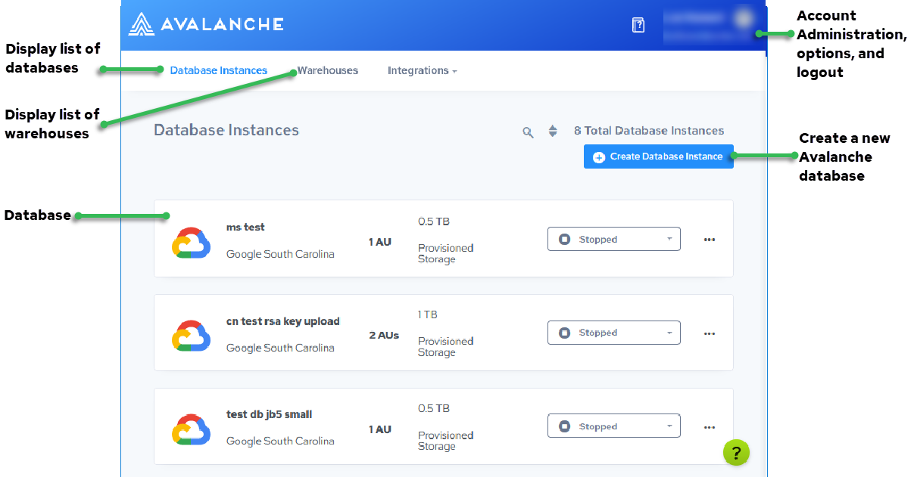

## Actian Data Platform Database Instances Console

Here are the primary features of the Database Instances page of the Actian Data Platform console.

| Next Step | Go to [Database Details](../Tutorials/Database_Details.md). |
| --- | --- |
