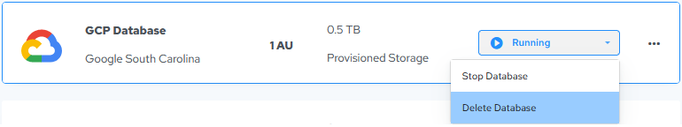

## Delete the Tutorial Database

Deleting a database removes it from your Actian account. After you delete a database, you are no longer charged for it.

!!! warning "Important"

    **IMPORTANT!**All data stored in the database is erased. Therefore you must confirm deletion.

To delete an Actian database

1. On the Actian Database Instances page, click the management dropdown for the Tutorial database and select Delete Database:

    

    The Delete Actian Database dialog appears.

2. Type DELETE (all caps) to confirm deletion.
3. Click Delete to delete the database.

    The database is removed from the Databases page.
