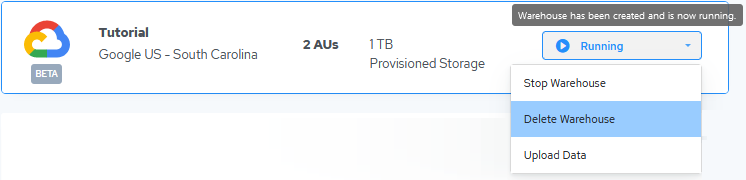

## Delete the Tutorial Warehouse

Deleting a warehouse removes it from your Actian account. After you delete a warehouse, you are no longer charged for it.

!!! warning "Important"

    **IMPORTANT!**All databases and data stored in the warehouse are erased. Therefore you must confirm deletion.

To delete an Actian warehouse

1. On the Actian Warehouses page, click the management dropdown for the Tutorial warehouse and select Delete Warehouse:

    

    The Delete Actian Warehouse dialog appears.

2. Type DELETE (all caps) to confirm deletion.
3. Click Delete to delete the warehouse.

!!! note "Note"

    For AWS and Azure, it takes about 10 minutes to delete a warehouse.

    The warehouse is removed from the Warehouses page.
