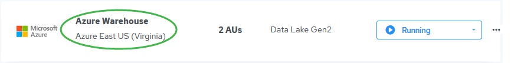
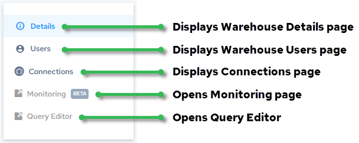

## Warehouse Details

Clicking the warehouse name in the list of warehouses displays details about the warehouse on the Warehouse Details page.

The following are the fields and controls on the Warehouse Details page:

| Field | Description |
| --- | --- |
| Status | Status of the warehouse: • Creating, Create Failed, Create Error Analysis • Starting, Start Failed • Running • Scaling, Scaling Failed • Stopping, Stopped, Stop Failed • Deleting, Deleted, Delete Failed • Unknown |
| Storage | AWS: The amount of AWS S3 storage available in the warehouse.]Azure: The Authentication mechanism that Actian supports to ingest data from a general-purpose v2 storage account is through Azure Active Directory using a service principal.The instructions in this section are intended to be performed in the Azure subscription, where the source data for Actian is located and the credentials that are generated must be supplied to Actian so that it can access and load the data.For more information, see Set Up Microsoft Azure Access.]Google Cloud: Google Cloud Storage.] |
| Compute | Number of Actian units (AUs) in the warehouse.Azure: You can scale the size of Azure warehouses; for more information, see [Scale a Warehouse](../User/ScaleWarehouse.md).] |
| Region | Geographical location of the warehouse |
| Warehouse ID | Unique ID of the created warehouse. If you encounter a problem, Actian Support will need this ID. |
| IP Allow List | Displays the Allow List IP addresses for warehouse access. Clicking the Show IP Labels toggle shows or hides text labels for the listed IP addresses:To add or remove IP addresses, see [Update Allow List IP Addresses](../User/UpdateAllowListIPs.md). |
| Idle Stop | Amount of time set before the warehouse is set to the stopped state after no database (query) activity. This time period was set at warehouse creation. Idle stop cannot be disabled in a non-production environment.For more information, see [Automatic Stopping of Idle Warehouses or Databases](../User/Automatic_Stopping_of_Idle_Warehouses_or_Databas.md). |
| External Table Access | Lets you set storage account authentication by entering environment credentials. For more information, see [Grant Access to Warehouse or Database for External Tables Access](../User/Grant_Access_to_Warehouse_or_Database_for_Extern.md). |
| Connection Password | Lets you set or reset the password for dbuser to connect to the warehouse. For more information about the dbuser, see [Set the dbuser Connection Password](../User/Set_the_dbuser_Connection_Password.md). If you have not set the password, do so now. The dbuser is a member of the dbadmingrp by default; for more information, see [Types of Users](../User/Types_of_Users.md). |
| Created By | Date and time of warehouse creation |
| Last Modified By | Date and time warehouse was last modified |

| Next Step | If you have created a warehouse for the first time, we recommend that you access Query Editor and start running sample queries.Go to [Launch Query Editor](../Tutorials/Launch_Query_Editor.md). |
| --- | --- |
