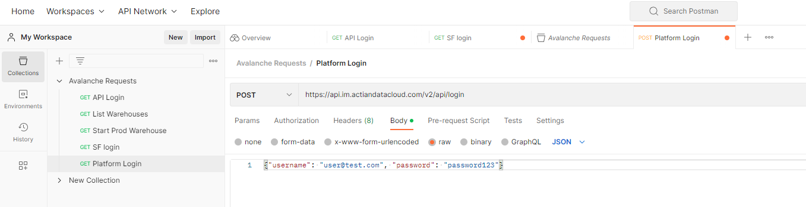
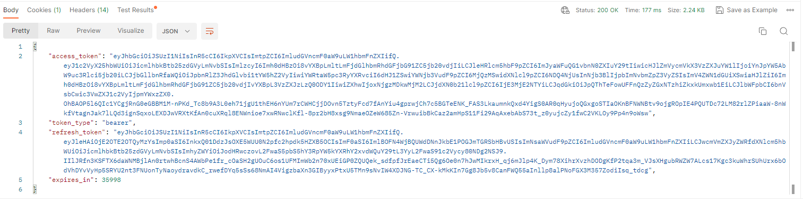

## API access with Platform User Accounts

!!! note "Note"

    This section is for Platform users want to access Actian Data Platform APIs. The example below assumes you use an API client like Postman.

Actian Data Platform Platform Users can access Actian Data Platform APIs with their user ID and password.

To access Actian Data Platform APIs as a Platform User:

1. Using an API client, enter the Actian Data Platform production API endpoint to make a POST request:

```
https://api.im.actiandatacloud.com/v2/api/login
```

2. In the Body section of the request, check raw, select the JSON option, and enter your platform username and password in body of the request:



3. Click SEND to send the request. If accepted, an access token and other related information will display.


