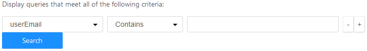
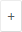

## AWS AV-1 and Azure Query History

| Criteria | Description |
| --- | --- |
| userEmail | The email address of the user who ran the query |
| connectionName | The database name the query was run against |
| startTime | The time the query started to run |
| stopTime | The time the query stopped running |
| durationMs | The duration of the query’s run time, in milliseconds |
| queryId | The internal query ID number of the query |
| queryName | The text name of the query when it was saved |
| queryText | The beginning of the actual query contents |
| rowCount | The number of rows the query returned |

To display query history

1. On the Query Editor toolbar, click the History button.

    The Query History dialog opens, displaying any queries that have been run. If you have run no queries, the list will be empty.

2. To filter the displayed queries list:

    a. Click the Add Filter button.

    The search criteria control is displayed:

    b. Select a field from the first dropdown, specify a choice in the second dropdown, and enter the text to search on.

    c. To add more search criteria, click the  button. To delete a search criterion, click its  button.

    d. Click the Search button.

    The history list is updated with queries that match your specified criteria.
