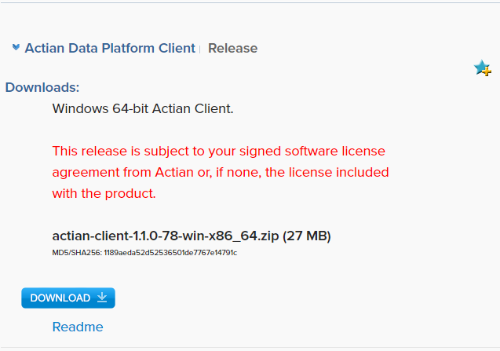

## Actian Client Runtime Package

Some tools require the installation of the Actian Client Runtime package.

The Actian Client (aka Client Runtime) is a client package that simplifies deployment of client-only installations running ODBC and JDBC applications across an enterprise with many clients and few servers. The package is smaller than a full server installation because it excludes some features that come with server clients, for example, ESQL/C. Actian Client is simpler to install because only relevant client-side configuration options and components are included: ODBC driver, JDBC driver, and the [The Actian SQL CLI, a Line-based Terminal Monitor](../SQLLanguage/Interactive_SQL.md).

You may download the Actian Client Runtime package from Actian’s Electronic Software Distribution (ESD). The Actian Client is never patched. To update your local copy, you must download and install a newer version.

!!! note "Note"

    If you download an RPM package, you must install as root. Ingbuild packages do not require elevated installation privileges.

To download and install the Actian Client package from ESD

1. [Go to https://esd.actian.com](https://esd.actian.com/).
2. On the ESD Customers Downloads page, select:

    - Product: Actian Data Platform

    - Release: Client Runtime

    - Platform: local machine’s operating system

3. Scroll down to the Actian Data Platform Client Runtime section and expand it, if necessary.
4. Click the HTTP button to download the driver. For example:

    

5. Save the Zip, tgz, or tar.Z file to a location on your local machine.
6. Read the readme file that is posted with the package.

7. Follow the installation instructions for your platform.

    This gives you the Actian JDBC driver, iijdbc.jar.
