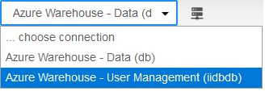

## Add Native Users

Only users in the useradmin and admin groups have the privilege to maintain other users. For more information, see [User Groups](../User/User_Groups.md).

- To add a warehouse user, you connect as the userdamin privileged user to the User Management database (iidbdb) where the users are maintained, and execute a [CREATE USER](../SQLLanguage/CREATE_USER.md) query.
- To add a database user, you connect as the admin privileged user to your database, and execute a [CREATE USER](../SQLLanguage/CREATE_USER.md) query.

To add native database users in Query Editor

1. [Launch Query Editor](../User/Launch_Query_Editor.md).
2. From the Connection dropdown menu, select the database to which you want to add a user:

3. Enter query text like the following to create a user:

```
create user analytics_user with profile=admin, password='AuEhN$*3Q1';
```

4. Click Run or Run Query.

    The statement is run and the user is created.

To add native warehouse users in Query Editor

1. [Launch Query Editor](../User/Launch_Query_Editor.md).
2. From the Connection dropdown menu, select the User Management (iidbdb) database:



3. Enter query text like the following to create a user:

```
create user analytics_user with profile=useradmin, password='AuEhN$*3Q1';
```

4. Click Run or Run Query.

    The statement is run and the user is created.

All of the following examples can be run in Query Editor or from the command line interface (the [Actian SQL CLI](../SQLLanguage/Actian_SQL_CLI.md), installed with the [Avalanche Client Runtime Package](../User/Access_Warehouse_or_Database_Connection_Informat.md)).

!!! note "Note"

    All examples assume connection to the User Management database (iidbdb). See examples of connections in [Overview of User Management](../User/Manage_Users_2.md).

Example 1

```
create user testuser1 with profile=useradmin, password='secret';
```

This example demonstrates how to create a user testuser1 with the privilege to maintain users with read-only access to the sample data and password “secret.”

Example 2

```
create user testuser2 with profile=user, password='secret';
```

This example demonstrates how to create a user testuser2 without the privilege to maintain users and read-only access to sample data and password “secret.”

Example 3

```
create user testuser1 with profile=useradmin, group=dbadmingrp, password='secret';
```

This example demonstrates how to create a user testuser1 with the privilege to maintain users and the ability to delete and update sample data or other data with user password “secret.”

Example 4

This example demonstrates how testuser1 is granted read-only access to the data owned by dbuser.

Log in to the Actian Data Platform as the user dbuser. Note that demo_table is an example table and is not provided by default.

```
grant select on dbuser.demo_table to testuser1
```

User testuser1 is now able to access (read-only) the data held in the dbuser table demo_table.

```
grant select on dbuser.demo_table to public
```

This statement would give any user within the db database read-only access to demo_table.

More information:

- [CREATE USER](../SQLLanguage/CREATE_USER.md)
- [Authorizing User Access for a Warehouse](../Security/Authorizing_User_Access_for_a_Warehouse.md)

- [GRANT (privilege)](../SQLLanguage/GRANT_(privilege).md) and [TABLE Privileges](../SQLLanguage/GRANT_(privilege).md)
