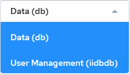

## Add SSO Users

If you try to connect to an Actian warehouse with an unregistered SSO user, you will receive the error message: “User authorization check failed. Either the user is not known to this installation, or an incorrect password was supplied.”

To add SSO users for admin db access, follow these basic steps:

1. Add the user to the warehouse. See [Add an SSO User to a Warehouse](../User/Add_SSO_Users.md).
2. Register the user with an Actian ID using the customer ID provided in the Actian Data Platform activation email. See [Register an SSO User with an Actian ID](../User/Add_SSO_Users.md).

3. The Actian Data Platform account owner must give the new user administrative rights in the console. See [Give SSO User Administrative Rights](../User/Add_SSO_Users.md).

## Add an SSO User to a Warehouse

In [Query Editor](../User/Part_QueryEditor.md), select the User Management (iidbdb) database connection:




Example 1

To add an administrative user who can manage users and has access to warehouse owner data:

```
CREATE USER "<short_name>" WITH LONG_NAME="<sso_login_name>", PROFILE=useradmin, GROUP=dbadmingrp, NOPASSWORD; GRANT ACCESS ON DATABASE db TO USER "<short_name>"; COMMIT;
```

For example:

```
CREATE USER "jane.doe" WITH LONG_NAME="jane.doe@acme.com", PROFILE=useradmin, GROUP=dbadmingrp, NOPASSWORD; GRANT ACCESS ON DATABASE db TO USER "jane.doe"; COMMIT;
```

To add new non-administrative users to the database, depending on the method used for creating, accessing, and managing data, you may require SSO users and native users to access the same data. A recommended strategy for doing this is defining a group for these two types of users and granting access to any new or existing tables to this new group.

Example 2

```
CREATE GROUP <new_group_name>;CREATE USER "<short_name>" WITH LONG_NAME="<sso_login_name>", GROUP=<new_group_name>, NOPASSWORD;
```

For example:

```
CREATE GROUP financing;CREATE USER "jose.diaz" WITH LONG_NAME="jose.diaz@acme.com", GROUP=financing, NOPASSWORD;
```

Give access to new or existing data to the new group with:

```
GRANT ALL PRIVILEGES ON <table_name> TO GROUP <new_group_name>;
```

Any user requiring access to the <table_name> can just be added to <new_group_name>.

More information:

- [CREATE USER](../SQLLanguage/CREATE_USER.md)
- [CREATE GROUP](../SQLLanguage/CREATE_GROUP.md)

- [GRANT (privilege)](../SQLLanguage/GRANT_(privilege).md) and [TABLE Privileges](../SQLLanguage/GRANT_(privilege).md)

## Register an SSO User with an Actian ID

To register an additional SSO user, follow the activation link provided in the Actian Data Platform fulfillment email. If this is unavailable, you may use a known Actian customer ID.

1. In a web browser, open the [Register for an Actian ID](https://ciam.actian.com/user/sign-up.php) page.
2. Check Select if you have a Support Contract.

3. Complete the information.

!!! note "Note"

    The email address you enter must be verifiable, must have the same domain as the email of the account owner (the same company domain), and cannot be an actian.com address. It must be the same email address as the long name of the SSO user added to iidbdb (see [Give SSO User Administrative Rights](../User/Add_SSO_Users.md)).

4. Click Register.

The registered user now has access to Actian Electronic Software Delivery (ESD), the Actian Community, and Actian Academy. Although the user can now log in to the Actian Data Platform console, they will be unable to view or interact with warehouses already created in the account. They must be assigned administrative rights by the account owner. See [Give SSO User Administrative Rights](../User/Add_SSO_Users.md).

## Give SSO User Administrative Rights

After a new SSO user is registered, the Actian Data Platform account owner must grant them administrative rights in the Actian Data Platform console.

To enable or disable Admin privileges for a user

1. Click the username of the user you want to modify.

    The User Details dialog opens.

2. Click the desired option next to Account Administrator.
3. Click Save.

To activate or deactivate a user

1. Click the username of the user you want to modify.

    The User Details dialog opens.

2. Click the Yes or No option next to Active.
3. Click Save.

Deactivated users will still be able to log in to the Actian Data Platform but be unable to view any warehouses.

To assign or modify a user’s role

!!! note "Note"

    The Role dropdown is available only for non-administrative users.

1. Click the username of the user you want to modify.

    The User Details dialog opens.

2. Select the role for the user from the Role dropdown.
3. Click Save.
