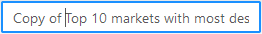

## Clone a Query

Cloning a query duplicates it. You may rename and edit this copy for other purposes. Refer to the appropriate section for your cloud platform.

AWS AV-1 and Azure: To clone a query

1. Create or display the query you want to clone in the query pane.

    See [Create and Save a New Query](../User/Create_and_Save_a_New_Query.md) or [Open a Saved Query](../User/Open_a_Saved_Query.md).

2. Click the Clone query button on the toolbar:

    

    The displayed query name is prepended with “Copy of.”

    

3. Modify the query as desired.
4. Rename the query as desired in the Query name field.

5. Click the Save icon to save the modified query:

    

    The cloned query is now available in the Saved Queries dialog (see [Open a Saved Query](../User/Open_a_Saved_Query.md)).

Google Cloud and AWS AV-2: To clone a query

1. Create or display the query you want to clone in the query pane.

    See [Create and Save a New Query](../User/Create_and_Save_a_New_Query.md) or [Open a Saved Query](../User/Open_a_Saved_Query.md).

2. Click the Clone Query button on the toolbar:

    

    The displayed query name is named “New Query #.”

3. Modify the query as desired.
4. Click the Save icon to save the modified query:

    

    The cloned query is now available in Saved Queries (see [Open a Saved Query](../User/Open_a_Saved_Query.md)).
