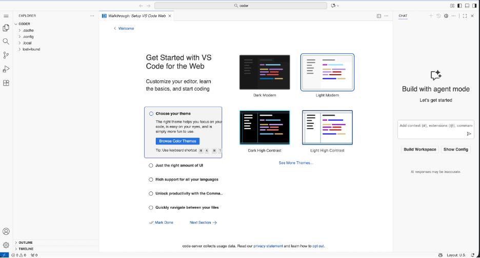

## Code Server

Code Server is a core platform service that provides a browser-based, full-featured integrated development environment (IDE) for building data processing scripts and ML models. It is a hosted, preconfigured instance of Coder code-server, which runs the open-source edition of Visual Studio Code (MIT license) in a web browser.

!!! note "Note"

    Code Server is a hosted, open-source tool. Actian does not maintain a custom VS Code fork. For editor-specific features, including debugging, extensions, and settings synchronization, see the [VS Code documentation](https://code.visualstudio.com/docs).

### Key Features

    - Open-source VS Code base: Code Server is built on the Visual Studio Code, which provides a familiar interface and feature set consistent with the desktop application.

    - Preinstalled data science stack: The environment comes ready for development with the following tools and libraries preinstalled:

| Category | Included items |
| --- | --- |
| Languages and frameworks | Python, PySpark |
| Data libraries | NumPy, Pandas, Matplotlib |
| Extensions | Jupyter Notebook, Python |

    - Database connectivity: Includes the Actian client and ODBC driver for direct communication with the Analytics Engine.

    - Customization: You can install additional extensions from the Open VSX Registry. All customizations, including installed extensions are backed by persistent storage and remain available after a warehouse restart.

!!! note "Note"

    You can access Code Server through a browser by using the warehouse hostname and a JWT bearer token.

### Enabling Code Server

By default, Code Server is disabled. To enable it, follow these steps:

1. Sign in to the Actian Analytics AI Platform, and navigate to the [Warehouses Console](https://docs.actian.com/actiandataplatform/User/Actian_Data_Platform_Warehouses_Console.md).
2. In the left navigation pane, turn on the ML Services toggle to enable ML services.

3. Select Code Server in the left navigation pane to open the IDE in a new browser tab.

### Preinstalled Software

Code Server is preconfigured with a Python virtual environment located in the container user's home folder.

!!! note "Note"

    The container runs as a non-root user without sudo access.

To inspect the current environment, run the following commands in the Code Server integrated terminal:

List all installed Python packages in the active virtual environment:

Bash

```
pip list
```

List all exported environment variables:

Bash

```
env
```

Show the active Python interpreter:

Bash

```
which python
```
