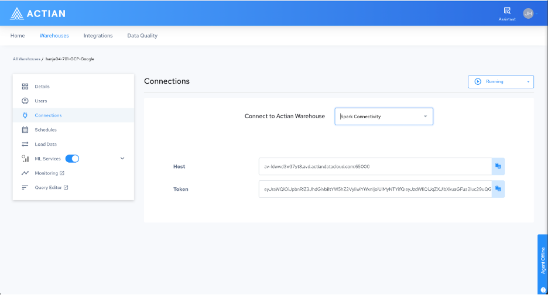

## Connections

The Connections page provides all the credentials and endpoints required to connect to warehouse services from external applications. Use the drop-down menu to switch between connection types.

For ML workloads, you need the following three values:

| Value | Description |
| --- | --- |
| Spark Connect host | The endpoint for connecting to the Spark Connect Server from an external client. |
| JWT bearer token | The authentication token required by all external service endpoints. |
| MLflow Tracking URI | The endpoint for logging and retrieving ML experiment data by using the MLflow client. |
| MLflow artifact location | The bucket path that will contain persisted models. |

To connect to the Spark server from a local machine, retrieve the host address and authentication token from the Connections page.
