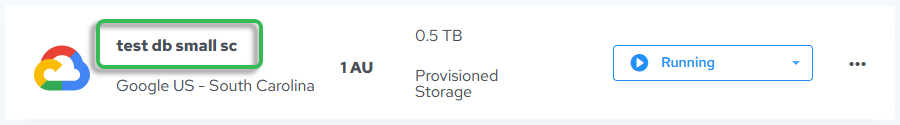
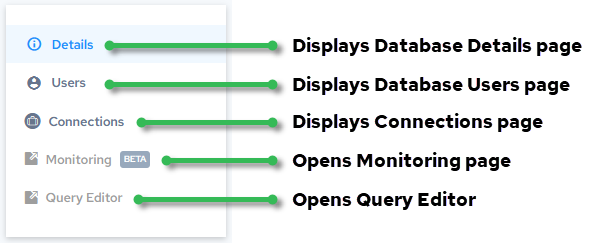

## Database Instance Details

Clicking the database name in the list of databases displays details about the database on the Database Instance Details page.

The following are the fields and controls on the Database Instance Details page:

| Field | Description |
| --- | --- |
| Status | Status of the database: • Creating, Create Failed, Create Error Analysis • Starting, Start Failed • Running • Scaling, Scaling Failed • Stopping, Stopped, Stop Failed • Deleting, Deleted, Delete Failed • Unknown |
| Storage | The amount of storage available in the database. |
| Compute | Number of Actian units (AUs) in the warehouse.You can scale the size of databases; for more information, see [Scale a Warehouse](../User/ScaleWarehouse.md). |
| Region | Geographical location of the database |
| Database ID | Unique ID of the created database. If you encounter a problem, Actian Support will need this ID. |
| Warehouse Version | The version number of the database in the format major.minor.patch. For more information about features in a particular warehouse version, see [Actian Warehouse Release Notes](../Welcome/Actian_Warehouse_Release_Notes.md). |
| IP Allow List | Displays the Allow List IP addresses for database access. Clicking the Show IP Labels toggle shows or hides text labels for the listed IP addresses:To add or remove IP addresses, see [Update Allow List IP Addresses](../User/UpdateAllowListIPs.md). |
| Idle Stop | Amount of time set before the database is set to the stopped state after no database (query) activity. This time period was set at database creation. Idle stop cannot be disabled in a non-production environment.For more information, see [Automatic Stopping of Idle Warehouses or Databases](../User/Automatic_Stopping_of_Idle_Warehouses_or_Databas.md). |
| External Table Access | Lets you set storage account authentication by entering environment credentials. For more information, see [Grant Access to Warehouse or Database for External Tables Access](../User/Grant_Access_to_Warehouse_or_Database_for_Extern.md). |
| DB Admin Access | Lets you upload an RSA public key (code or external .json file) to connect to the database. The database owner is a member of the dbadmingrp by default; for more information, see [Types of Users](../User/Types_of_Users.md). |
| Change Log | • Displays the date and time of database creation • Displays the date and time the database was last modified |

More information:

- Users page – [Display Users from the Warehouse Details or Database Instances Page](../User/Display_Users_from_the_Warehouse_Details_or_Data.md)
- Connections page – [Access Warehouse or Database Connection Information](../User/Access_Warehouse_or_Database_Connection_Informat.md)

- Monitoring page – [Monitor Warehouses](../User/Monitor_Warehouses.md) (currently not available for Google Cloud warehouses)
- Query Editor page – [Query Editor](../User/Part_QueryEditor.md)
