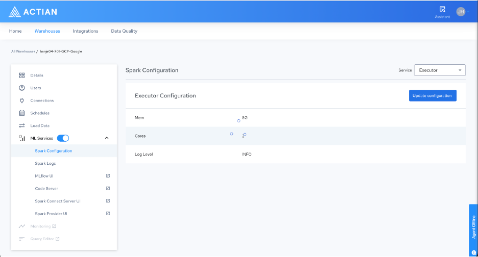
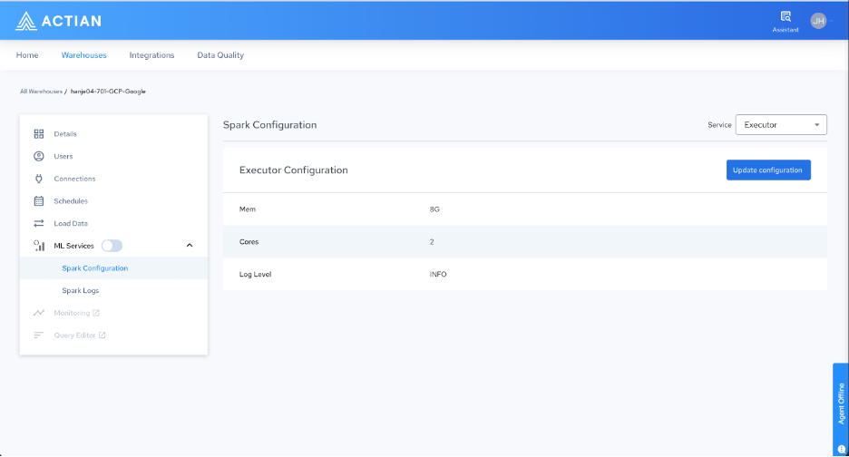

## Enabling ML Services

By default, ML services are disabled on all warehouses. To enable them, follow these steps:

1. Log in to the Actian Analytics AI Platform, and navigate to the [Warehouses Console](https://docs.actian.com/actiandataplatform/User/Actian_Data_Platform_Warehouses_Console.md).
2. In the left navigation pane, turn on the ML Services toggle.

    The ML Services page is displayed.

!!! note "Note"

    When ML services are disabled, only Spark Configuration and Spark Logs appear under the ML Services entry in the left navigation pane. No service links, such as MLflow UI, Code Server, Spark Connect Server UI, or Spark Provider UIare displayed.

3. After you turn on the toggle, the platform begins initializing the services. When all pods reach a running state, the complete list of ML service links appears in the left navigation pane. Select any link to open the corresponding service UI in a new browser tab.

    The following entries appear in the left navigation pane:

| Service | Description |
| --- | --- |
| Spark Configuration | Configures CPU cores, memory, and log levels for the Executor, Provider, and Connect Server components. |
| Spark Logs | Displays live and historical logs for Spark jobs to help you monitor and troubleshoot workloads. |
| MLflow UI | Opens the MLflow tracking interface to compare experiment runs, manage model versions, and oversee the ML lifecycle. |
| Code Server | Opens a browser-based VS Code IDE preinstalled with Git, PySpark, NumPy, Pandas, and Jupyter Notebook support. |
| Spark Connect Server UI | Displays active sessions and server-side logs for the Spark Connect Server to help you monitor external client connections. |
| Spark Provider UI | Displays health and logs for the Spark Provider pod, which handles external table processing and Scala UDFs. |
