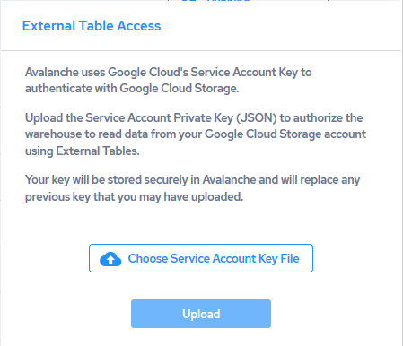

## Give Your Actian Warehouse Access to Google Cloud Storage

To enable your Actian warehouse or to access your Google Cloud storage account, you must upload the JSON key file downloaded to your local machine in [Step 2: Generate a Google Cloud Service Account Key](../User/Set_Up_Access_Credentials_for_Cloud_Storage_Acco.md).

!!! note "Note"

    The warehouse must be running to set service account credentials.

To add the keys to your Actian warehouse

1. In the Actian warehouses console, click the warehouse name to display its [Warehouse Details](../User/Warehouse_Details.md) page.
2. In the External Table Access row, click the Set Service Account Credentials link.

    The External Table Access dialog opens.

3. Click the Upload Service Account Key File button.

4. Browse your local file system, select the key file that was download from Google Cloud (named <account_name>.json), and click Open.

    The key filename is displayed in the dialog.

    To remove the key, click the delete button .

5. Click the Upload button.

    The key file is uploaded to your Actian warehouse/database. This may take up to a minute to take effect.

Your key will be stored securely in the Actian Data Platform and will replace any previous key that you may have uploaded.

Your warehouse or database can now access your Google Cloud data in the cloud, and you may now run queries against the data source using the [Query Editor](../User/Part_QueryEditor.md).
