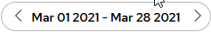
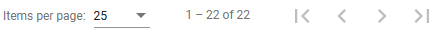

## Google Cloud and AWS AV-2 Query History

| Criteria | Description |
| --- | --- |
| Start Time | The time the query started to run |
| Query | The query text |
| Duration | The duration of the query’s run time, in milliseconds |
| Row Count | The number of rows the query returned |
| User | Hover message displaying the username of the user who ran the query. This text cannot be searched on. |
| Query ID | Hover message displaying the internal query ID number of the query. This text cannot be searched on. |
| Query Name | Hover message displaying the text name of the saved query. This text cannot be searched on. |

To display query history

1. In the left pane, click the Query History link.

    The Query History panel opens, displaying any queries that have been run. If you have run no queries, the list will be empty.

2. Expand the panel to full screen by clicking the << link.
3. To filter the displayed queries list:

    a. Enter text in the Search field. You can search on this information:

        - Query text

        - Duration numbers (without “ms”)

        - Row count numbers

    The history list is updated with queries that match your specified criteria.

    b. Select a date range from the date field:

    

    c. Scroll down to the bottom of the list and switch pages:

    

4. Shrink the Query History panel by clicking the >> link.
