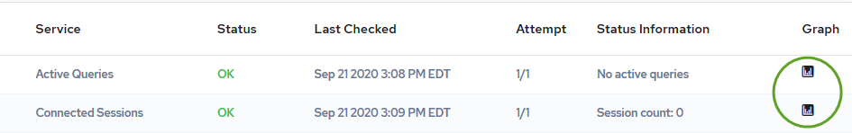
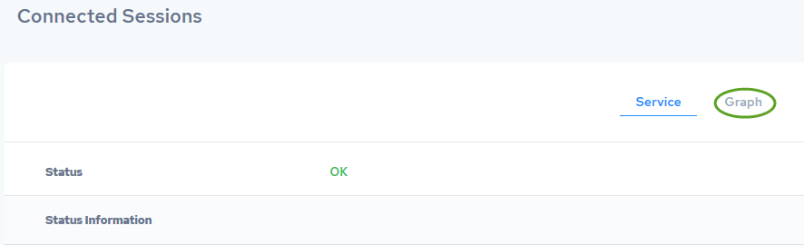
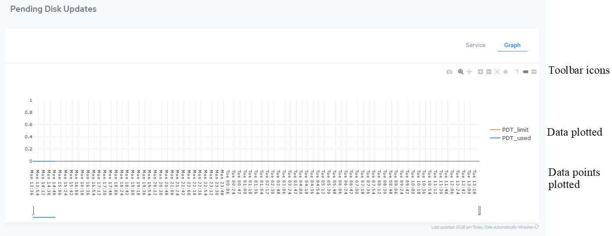

## Graphing Service Information

There are two ways to display service information in graph format:

- From the Monitoring page:

- From the service page, Graph tab:

    

When you click either of these graph links, the Graph tab for the service is displayed, showing any available data.

