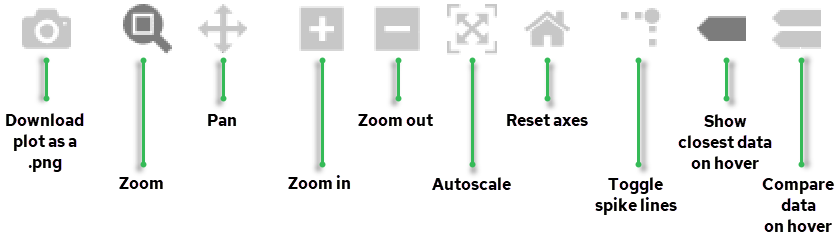

## Graphing Toolbar Icons

| Tool | Description |
| --- | --- |
| Download plot as png | Downloads and saves a captured image of the current view of the chart. For more information, see [Download a Chart as a PNG File](../User/Download_a_Chart_as_a_PNG_File.md). |
| Zoom | Holding and dragging the mouse zooms in on the selected area. For more information, see [Zoom in on Graphing Data](../User/Zoom_in_on_Graphing_Data.md). |
| Pan | Holding and dragging the mouse pans around the chart. |
| Zoom in | Zooms in on the chart. For more information, see [Zoom in on Graphing Data](../User/Zoom_in_on_Graphing_Data.md). |
| Zoom out | Zooms out on the chart. For more information, see [Zoom in on Graphing Data](../User/Zoom_in_on_Graphing_Data.md). |
| Autoscale | Shows all chart data, even data outside of the axis area (if any). For more information, see [Zoom in on Graphing Data](../User/Zoom_in_on_Graphing_Data.md). |
| Reset axes | Resets chart axes to their original values. |
| Toggle spike lines | Draws a dotted line for X and Y values to the intersection of the lines. |
| Show closest data on hover | Shows the nearest data point value to the mouse pointer. |
| Compare data on hover | Shows all available hover data at the same time. |
