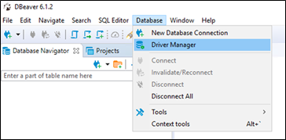
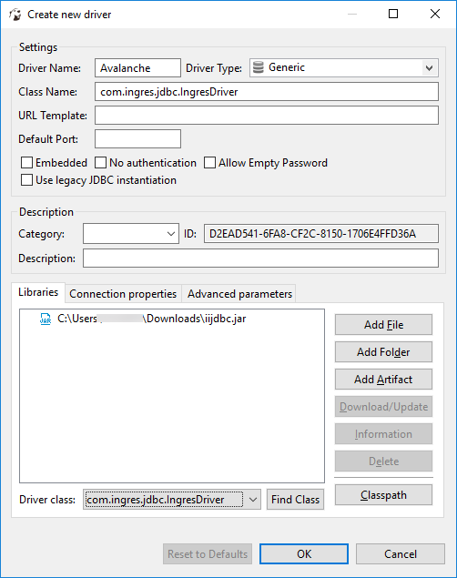

## Install DBeaver and Set Up an Actian Driver

To install DBeaver

If you have not already done so, download the Community Edition of DBeaver from [https://dbeaver.io/download/](https://dbeaver.io/download/) for your platform and install it.

- For Windows, we recommend downloading the package that includes the JRE.
- For Mac, we recommend downloading the dmg package.

Accept all the default options when running the installer.

To set up an Actian driver in DBeaver

1. Launch the DBeaver application.

    The Select your database dialog appears.

2. Click Cancel; you must set up an Actian driver first.

    If you see the Create Sample Database dialog, click Cancel.

3. Click Database, Driver Manager.

    

    The Driver Manager dialog opens.

4. Click New.

    The Create new driver dialog opens.

5. Enter the Driver Name Actian.
6. Select the Driver Type Generic.

    You should have the iijdbc.jar file if you downloaded it. If you have not done so, follow the instructions at [Actian JDBC Driver](../User/Actian_JDBC_Driver.md).

7. Add the iijdbc.jar file:

    a. Click Add File.

    b. Navigate to the location where you extracted the JDBC driver package and select the iijdbc.jar file.

    c. Click Open.

    The .jar file is added to the library list.

**IMPORTANT!**Ensure that the “Use legacy JDBC instantiation” checkbox is deselected, as shown below.

8. Click Find Class.

    The Driver class and Class Name are populated with com.ingres.jdbc.IngresDriver. If not, type it in the Class Name field.

    

9. Click OK.

    The Actian driver is added to the Driver Manager list.

10. Close the Driver Manager dialog.
