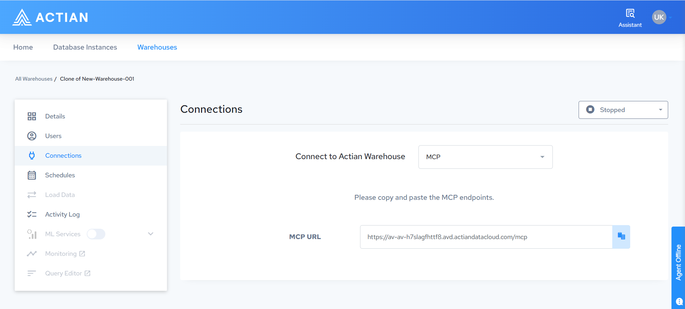

# MCP Server for warehouse data access

Every warehouse with MCP enabled exposes a Model Context Protocol (MCP) endpoint. An MCP-compatible client that connects to this endpoint can explore schema metadata and run SQL queries against the data in that warehouse.

There is nothing to install or configure. The endpoint is created with the warehouse and is specific to it.

!!! note
    This page covers access to the data inside a warehouse. To create, start, stop, and monitor warehouses from an MCP client, see [MCP Server](MCP_Server.md).

## Get the connection URL

1. Go to **Warehouses** and select your warehouse.
2. Select **Connections**.
3. In the connection list, select **MCP**.
4. Copy the MCP URL.

The URL is specific to the warehouse and has the form `https://<warehouse-host>/mcp`.

## What to know before you connect

- The warehouse must be running.
- Warehouse IP restrictions apply to MCP connections. The machine running the client must fall within the warehouse IP allow list. See [Data Access and Authentication](../Security/Data_Access_and_Authentication.md).
- The client signs in with OAuth, not with a database username and password. Queries then run under your own database identity, and your existing table privileges apply. See [User Management](../Connectivity/User_Management.md).

## Client configuration and available tools

For client configuration examples, the tool, resource, and prompt reference, and how write approval works, see [SaaS](https://actiancorp.github.io/mcp-server-docs/latest/analytics-engine/saas.html) in the MCP Server documentation.

## Related documentation

- [MCP Server](MCP_Server.md), for warehouse management operations
- [Warehouse Data API](Warehouse_Data_API.md)