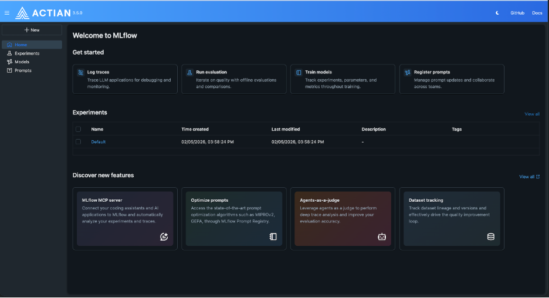

## MLflow

Sparkforce includes a hosted, provisioned instance of the open-source MLflow platform. MLflow manages the ML lifecycle by tracking experiments, storing model artifacts, and serving registered models. The platform hosts the standard MLflow UI within the Sparkforce environment. For more information, see the [MLflow documentation](https://mlflow.org/docs/3.5.1/).

| Component | Description |
| --- | --- |
| Tracking UI | A dedicated interface for monitoring ML experiments, runs, parameters, and metrics. |
| Database backend | Stores hyperparameters and training parameters recorded during experiments. |
| Artifact storage | Persists trained models for later retrieval and serving. The storage type depends on the deployment environment: Amazon S3 for AWS, or GCS for Google Cloud. |
| Preinstalled client | The MLflow library comes preinstalled in the platform's Code Server environment, which allows scripts to connect directly to the tracking server without additional setup. |

The primary purpose of this service is to enable you to run ML training scripts from within Code Server or from a local machine and systematically record the results. To connect from an external machine, retrieve the MLflow Tracking URI and storage bucket name from the Connections page.

### Enabling MLflow

By default, MLflow is disabled. To activate the service, follow these steps:

1. Sign in to the Actian Analytics AI Platform, and navigate to the [Warehouses Console](https://docs.actian.com/actiandataplatform/User/Actian_Data_Platform_Warehouses_Console.md).
2. In the left navigation pane, turn on the ML Services toggle to enable ML services.

3. Select MLflowUI in the left navigation pane to open the tracking server.

The MLflow interface opens in a new browser tab. You can now use all MLflow features, including experiments, runs, parameters, metrics, and model artifacts.

!!! note "Note"

    Disabling the MLflow service pod does not delete data. Data is removed only when the warehouse is deleted or the underlying storage bucket is explicitly cleared.

### Running Inference from the Actian Analytics Engine by Using a Scala UDF

A model trained in Spark can be invoked directly from within the Actian Analytics Engine by using a Scala UDF. This approach lets you run inference against data already loaded in the Analytics Engine without routing data through Spark, which reduces both latency and processing overhead.

### Importing External Models

MLflow supports a broad model-flavor ecosystem. Any model that can be serialized to a format that MLflow supports including pyfunc, PyTorch, and Transformers can be logged and registered in the Sparkforce model registry.

!!! note "Note"

    Support for external model sources. For the complete list of supported model flavors, see the [MLflow documentation](https://mlflow.org/docs/3.5.1/).
