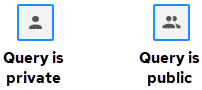

## Make a Query Shared or Private

Queries may be either private, meaning they are only available to you in your list of saved queries, or shared (public), meaning they are available to all users of the warehouse. You can share any query with other users of your account by making it shared.

AWS AV-1 and Azure: To make a query public or private

By default, all new queries are private, meaning they are only available to you in your list of saved queries. But you can share any query with other users of your account by making it public.

On the Query Editor toolbar, click the Query is private/Query is shared button:

The query is either displayed or removed from the public list of queries.

Google Cloud and AWS AV-2: To make a query public or private

You can set the availability of queries the first time you save them. See [Create and Save a New Query](../User/Create_and_Save_a_New_Query.md).

To change the availability of an existing saved query:

1. In the left pane, click the Saved Queries link.

    The Saved Queries panel opens, listing all available queries.

2. Control the display of queries by selecting Shared or Private. You also may use the Search field to narrow displayed queries.
3. For the query you want to modify, click the Edit Query Properties icon: 

    The Edit Query dialog opens in the panel.

4. Change the Shared selection to make the query public (Yes) or private (No).
5. Click the Update button to save your changes.
