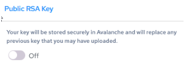

## Manage Public RSA Keys for Database Administrator Access

Actian Data Platform account administrators may manage RSA keys to enable or disable DBA access to the database. For more information, see [User Roles](../User/User_Roles.md).

The Rivest-Shamir-Adleman (RSA) encryption algorithm is an asymmetric encryption algorithm that uses a mathematically linked key pair to encrypt and decrypt data for transport. The key pair is comprised of a private key, kept secret by the key-pair creator, and a public key, which anyone can use. When messages or data is encrypted with one key, it can only be decrypted by the other key.

The Actian Data Platform uses the RSA algorithm to encrypt database transactions through the firewall over SSH. Account Administrators enter the public key on the [Database Instance Details](../User/Database_Instance_Details.md) page. To enter or upload a public key, you must first generate a key pair.

Tasks covered in this section include:

- [Generate SSH RSA Keys](../User/Manage_Public_RSA_Keys_for_Database_Administrato.md)
- [Upload a Public RSA Key to Enable DBA Access to a Database](../User/Manage_Public_RSA_Keys_for_Database_Administrato.md)

- [Disable DBA Access to a Database](../User/Manage_Public_RSA_Keys_for_Database_Administrato.md)
- [Establish Database Access of SSH](../User/Manage_Public_RSA_Keys_for_Database_Administrato.md)

## Generate SSH RSA Keys

To enable secure DBA access to an Actian database, you must generate RSA keys.

To generate SSH public and private keys

- Windows – You can generate the SSH public and private keys using PuTTYgen. See [Using PuTTYgen on Windows to generate SSH key pairs](https://www.ssh.com/academy/ssh/putty/windows/puttygen).
- Linux – You can generate the SSH public and private keys using the Linux ssh-keygen utility. See [How to use ssh-keygen to generate a new SSH key](https://www.ssh.com/academy/ssh/keygen).

The result is to generate a public key that you can either copy and paste or upload from a .pub file.

## Upload a Public RSA Key to Enable DBA Access to a Database

After you have generated your RSA keys, you must upload it to the Actian Data Platform to enable DBA access.

To upload a public key to enable DBA access to an Actian database

1. Click the Database Instances link on the Actian Data Platform console.

    Database instances are listed.

2. Click the name of the database for which you want to enter an RSA public key.

    The [Database Instance Details](../User/Database_Instance_Details.md) page is displayed for that database.

3. Scroll down to the DB Admin Access field and click Upload RSA Public Key.

    The Public RSA Key dialog opens.

4. Do one of the following:

    - Copy the long RSA public key to the clipboard and paste it in the box at the top of the dialog.

    - Drag and drop the .pub key file onto the box at the bottom of the dialog.

    - Click Choose RSA Public key file at the bottom of the dialog and browse to find and upload the .pub file containing the public key.

5. Click the Upload RSA Public key file button.

    The RSA public key is uploaded to the Actian Data Platform.

6. Ensure the toggle switch is set to On at the top of the dialog.

If you change your RSA keys, you can override an existing key that you have entered simply by uploading a new key following the above process.

## Disable DBA Access to a Database

You may disable DBA access to an Actian database by turning off access to the RSA public key.

To disable database administrator access to a database

1. Click the Database Instances link on the Actian Data Platform console.

    Database instances are listed.

2. Click the name of the database for which you want to disable DBA access.

    The [Database Instance Details](../User/Database_Instance_Details.md) page is displayed for that database.

3. Scroll down to the DB Admin Access field and click Upload RSA Public Key.

    The Public RSA Key dialog opens.

4. Click the toggle at the top of the dialog to Off:



DBA access to the database is now disabled until you enable access again.

## Establish Database Access of SSH

Database administrators can access an Actian database through an SSH command shell or other applications. To do so, you must establish a connection to the database over SSH using the private key.

To establish database access of SSH

From your command shell, enter the following command:

```
ssh -i <path to your private key file> actian@<DatabaseID>.console.actiandataplatform.com -p 2232
```

The Actian Data Platform uses port 2232 through the firewall.
