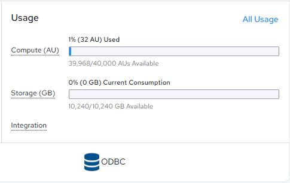
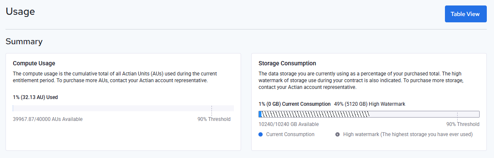
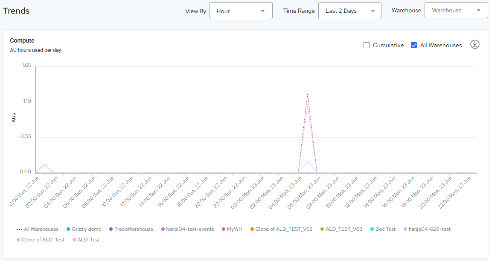
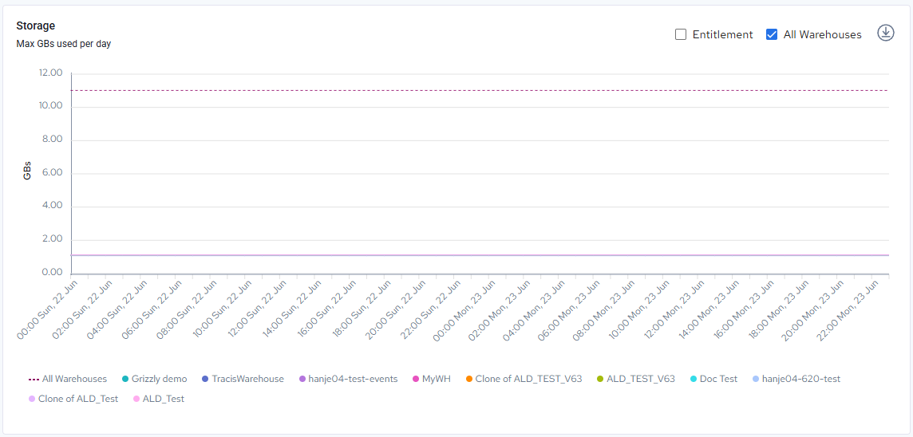

## Monitor AU Usage

!!! note "Note"

    This section is for users with Account Administrator access to an Actian Data Platform account. For more information, see [User Roles](../User/User_Roles.md).

Account administrators may monitor AU usage either from the Home dashboard or using the Administration interface.

For more information about AUs, see [Actian Units](../User/Concepts_to_Understand.md) and [Warehouse Cost and Actian Units](../User/Concepts_to_Understand.md).

To monitor AU usage

1. From the Home dashboard, find the Usage section..

    The Dashboard Usage section displays:

    - Compute (AU), which is the size of your cluster in terms of AUs.

    - Storage (GB), which is the amount and percentage of your total storage in use.

    - Integration,which is the amount of resources spent over a specific period of time on integration tasks.

2. Click All Usage to see all Usage details.

!!! note "Note"

    You can also use the upper right corner of the console window, click the user menu, select Administration, then in the menu pane on the left, click Usage for all usage details.

    The Usage section displays:

    - Summary, including Compute and Storage Consumption. You can also change this to a Table View of these metrics.

    - Trends Graph, which looks at compute usage over a period of time.

    - Storage Graph,which looks at the storage capacity of your warehouses individually or cumulatively.

    

If you need to add more AU hours to your account, contact Actian Sales at sales@actian.com.
