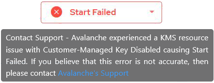

## Network Data Encryption Troubleshooting

Unable to establish network data encryption. Network encryption must be enabled on the client connection and the same security mechanism must be configured for network encryption in both client and server installations.

You are using an old version of the Actian Client. You must manually enable security settings before connecting to the Actian Data Platform:

1. Run the Windows Command Shell (cmd) as Administrator.
2. Enter the command:

```
iipmhost
```

    This will return the hostname, which you will need for the remaining steps.

3. Run:

```
iisetres ii.<hostname from step 2>.gcf.ob_encrypt_mode on
```

4. Run:

```
iisetres ii.<hostname from step 2>.gcf.mechanisms aes
```

For new clients starting with version [5.1.0-182](https://esd.actian.com/product/drivers/Client_Runtime/Windows_64-Bit/Client_Runtime), this manual configuration will no longer be required.

Warehouse startup fails with a message about a KMS resource issue.

When starting and stopping warehouses, your key alias decryption must be available. This means that your key alias must be enabled.

Your KMS master key ID must not be disabled or deleted from your KMS provider. If it is, warehouses using that disabled key alias will fail on startup with a Start Failed message:



To correct this problem, either re-enable the master key on your KMS, or create a new one and assign it in the Actian Key Management Service.
