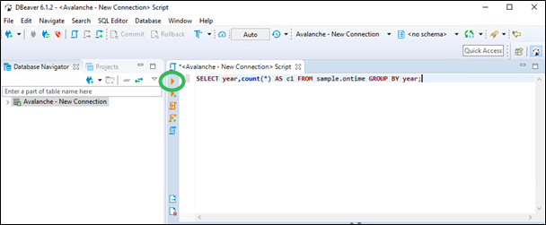

## Run a Query

To run a query in DBeaver

1. Click SQL Editor, SQL Editor (or press F3).

    A SQL script window opens.

2. Copy and paste the following query statement in the script window:

```
SELECT year,count(*) AS c1 FROM sample.ontime GROUP BY year;
```

3. Press Ctrl+Enter to run the query or click the Play button:

    

4. Examine the results.

To run more sample queries, go to [Run Sample Queries](../User/RunSampleQueries.md).
