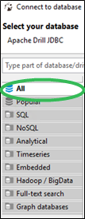
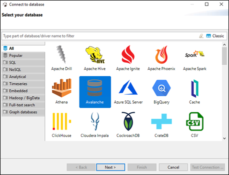
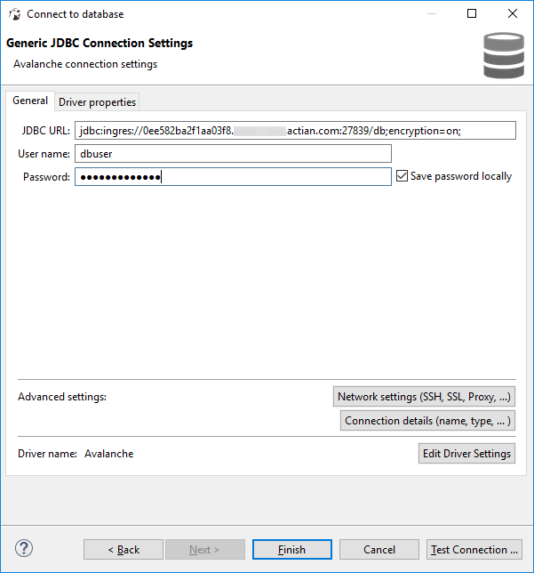
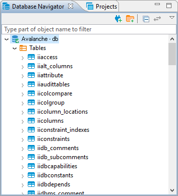

## Select the Actian Database Driver and Connect to a Warehouse

To select the Actian database driver in DBeaver and connect to your Avalanche warehouse

1. Start the DBeaver application.
2. Click Database, New Database Connection.

    The Connect to database dialog opens.

3. Select the All tab on the left to show all drivers.

    

4. Select the Actian driver and click Next.

    

5. Paste the JDBC connection string (from step 3 of [Get Connection Properties for DBeaver](../User/Get_Connection_Properties_for_DBeaver.md)) into the DBeaver JDBC URL field.
6. In the User name and Password fields, enter the username (dbuser) and password you set in the [Set the dbuser Connection Password](../User/Set_the_dbuser_Connection_Password.md) procedure.

    

7. Click Test Connection.

    If you are notified of missing drivers, select them and click Download.

8. Upon successful connection, close the confirmation dialog and click Next.
9. Click Next again and then Finish.

    The connected warehouse is listed in the Database Navigator tab. The Actian database is included in the display.

