# Set Up Access Credentials for Cloud Storage Accounts

## Set Up Google Cloud Access

One way to bulk-load data into the Actian Data Platform is to:

1. Stage it in a Google Cloud Storage bucket in your Google Cloud project.

    A Google Cloud storage bucket is a uniquely named public cloud storage resource available in Google Cloud. Google Cloud storage buckets are similar to file folders and store objects consisting of data and its descriptive metadata. For more information, see [Buckets](https://cloud.google.com/storage/docs/json_api/v1/buckets).

2. Grant permissions to the Actian warehouse
3. (through the generated service account key) to enable reading from the bucket.

4. Execute the relevant SQL on the Actian warehouse to read that data and store it in Actian Data Platform’s native columnar format.

!!! note "Note"

    We recommend that you create a separate Google Cloud service account with the relevant permissions to the bucket where the source data resides. You can then generate access keys for this service account and provide them to the Actian warehouse.

To give your Actian warehouse access to Google Cloud service account data, you will follow these basic steps:

|  | [Step 1: Create a Google Cloud Service Account](../User/Set_Up_Access_Credentials_for_Cloud_Storage_Acco.md) |
| --- | --- |
|  | [Step 2: Generate a Google Cloud Service Account Key](../User/Set_Up_Access_Credentials_for_Cloud_Storage_Acco.md) |
|  | [Step 3: Authorize Your Google Cloud Service Account for Actian Data Platform Access](../User/Set_Up_Access_Credentials_for_Cloud_Storage_Acco.md) |

## Step 1: Create a Google Cloud Service Account

To give the Actian Data Platform access to data stored in Google Cloud storage, you must create a service account in your Google Cloud project in the Cloud Console.

To create a Google Cloud service account

1. Log in to [Google Cloud Platform](https://console.cloud.google.com/).
2. If the navigation menu on the left is not displayed, click the Navigation icon to display it:

    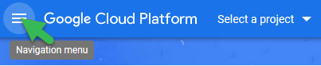

3. From the dropdown menu, select the project that you want to create the service account in.
4. From the navigation menu, click IAM & Admin, Service Accounts:

    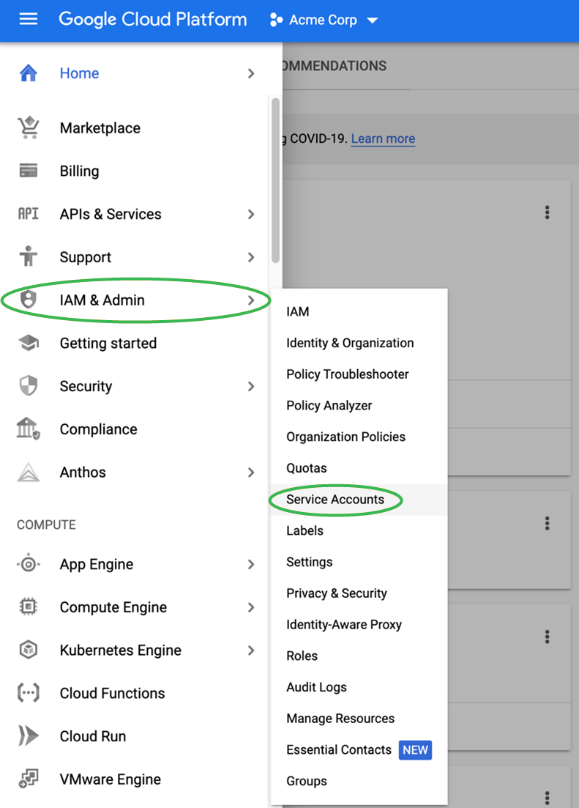

    The Service accounts page for your company is displayed.

5. Click + CREATE SERVICE ACCOUNT:

    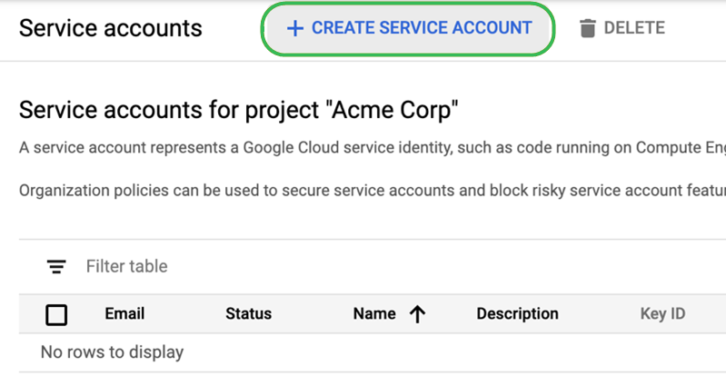

    The Create service account page is displayed.

6. Enter your service account details:

    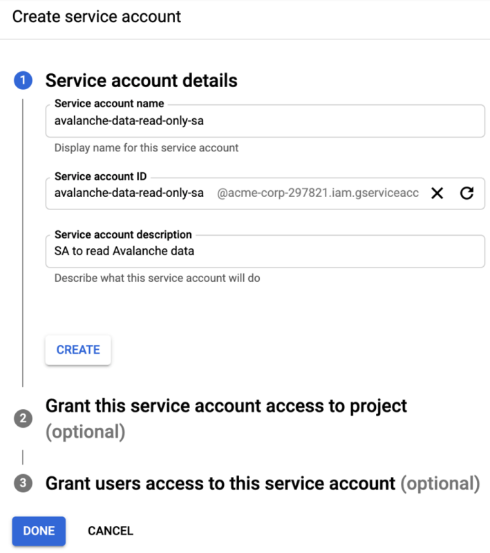

7. Click the CREATE button.
8. Do not add any roles or set any conditions; just click CONTINUE.

    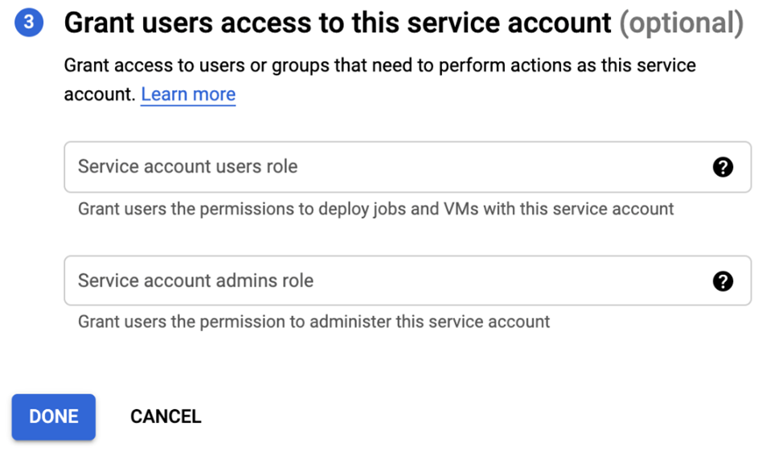

9. Do not grant users access to the service account; just click DONE.

    The new service account is listed:

    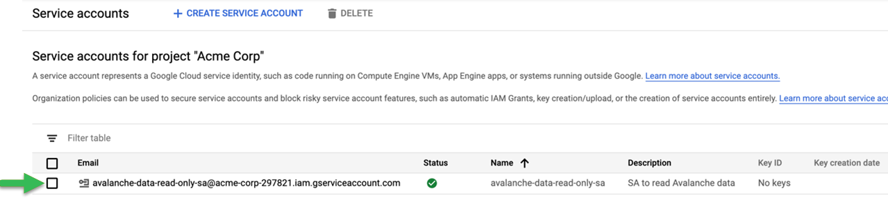

10. Click on the newly created service account to see the details:

    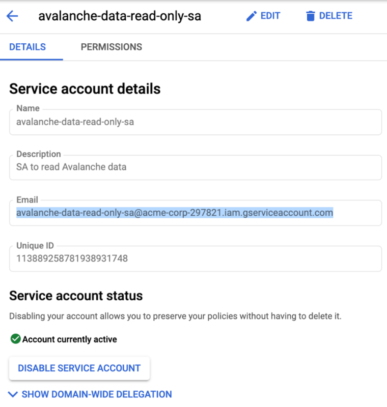

11. Copy the email as shown above. You will use this copied value later.
12. Click the back arrow to return to the service account page.

The service account has been created but does not yet have access to any resources in your project. You should first create a key before authorizing this service account to access a bucket—go to [Step 2: Generate a Google Cloud Service Account Key](../User/Set_Up_Access_Credentials_for_Cloud_Storage_Acco.md).

## Step 2: Generate a Google Cloud Service Account Key

To grant the Actian Data Platform access to your Google Cloud service account, you must generate a set of keys that you will download to your local machine. These keys will later be uploaded to your Actian warehouse.

To generate a set of keys to give the Actian Data Platform access to your Google service account

1. Click the link for the service account that you created in [Step 1: Create a Google Cloud Service Account](../User/Set_Up_Access_Credentials_for_Cloud_Storage_Acco.md).

    

    The Service account details page is displayed:

2. Under the Keys heading, click the ADD KEY dropdown menu and select Create new key:

    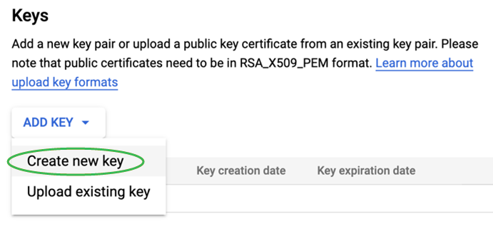

    The Create private key dialog opens.

3. Select the JSON key type and click CREATE:

    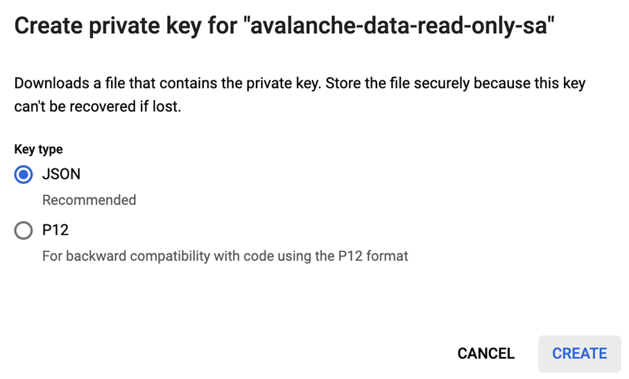

    The generated key is downloaded to your local machine:

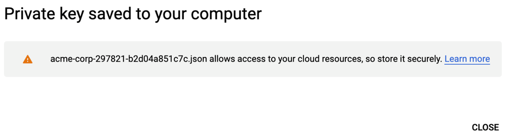

The next step is to authorize this service account for minimal access to the specific bucket that you want the Actian Data Platform to read data from—go to [Step 3: Authorize Your Google Cloud Service Account for Actian Data Platform Access](../User/Set_Up_Access_Credentials_for_Cloud_Storage_Acco.md).

## Step 3: Authorize Your Google Cloud Service Account for Actian Data Platform Access

To authorize your Google Cloud service account for access to the bucket and configure Actian Data Platform access

1. Navigate to the STORAGE section on the Google Cloud navigation menu and click Storage, Browser.

    A list of your storage buckets is displayed:

    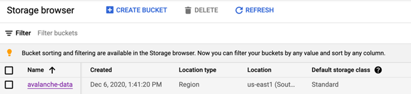

2. Click on the name of the bucket you want to authorize access to. In the above example, it is **avalanche-data**.

    The Bucket details page is displayed:

    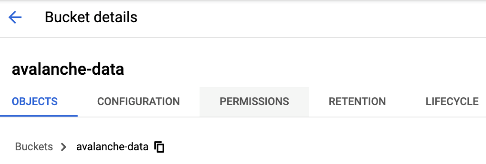

3. Click the Permissions tab and then click the ADD button:

    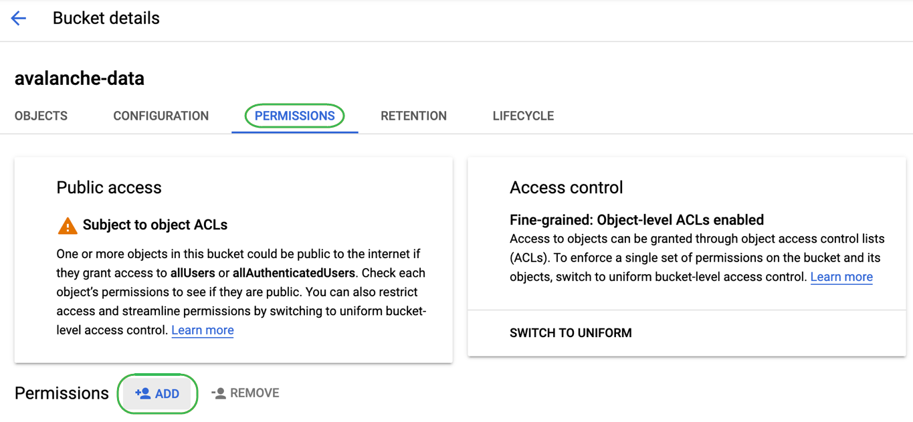

    The Add members panel is displayed.

4. Paste the email address into the New members field from the value you copied into the clipboard earlier. (You also may type it out, but it takes a while for auto-suggestion to start working for a newly created service account).
5. Click Select a role and choose Cloud Storage, Storage Object Viewer as shown below. This limits the service account with read-only access to the files in the bucket.

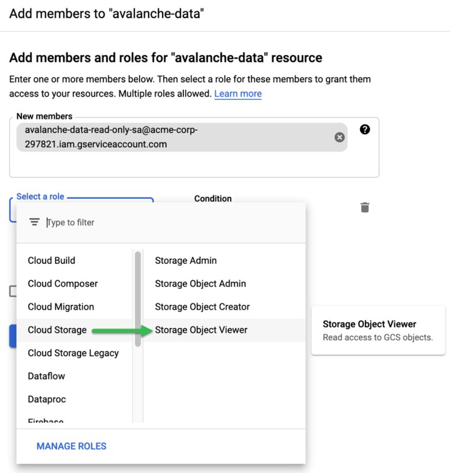

Click the SAVE button to close the panel.

If you intend to use external tables to load the data, you must grant the warehouse access to your Google Cloud storage account using the service account key created above. See [Give Your Actian Warehouse Access to Google Cloud Storage](../User/Give_Your_Actian_Warehouse_Access_to_Google_Clou.md).

Now that you have credentials, you may use them to load data into the Actian Data Platform from external tables or using the COPY VWLOAD statement. For more information, see [Cloud Object Storage Loading Methods](../DataLoading/OverviewSQLDataLoading.md).

More information:

- [Loading Delimited Text Data from External Tables (SQL)](../DataLoading/Loading_Delimited_Text_Data_from_Cloud_Data_Stor.md)
- [Loading Parquet Data from External Tables (SQL)](../DataLoading/LoadingParquet.md)

- [Loading JSON Data from External Tables (SQL)](../DataLoading/LoadingJSONData.md)
