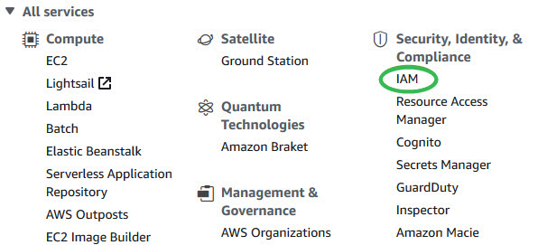
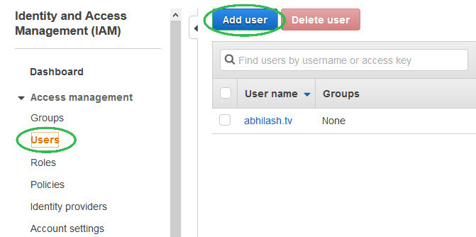
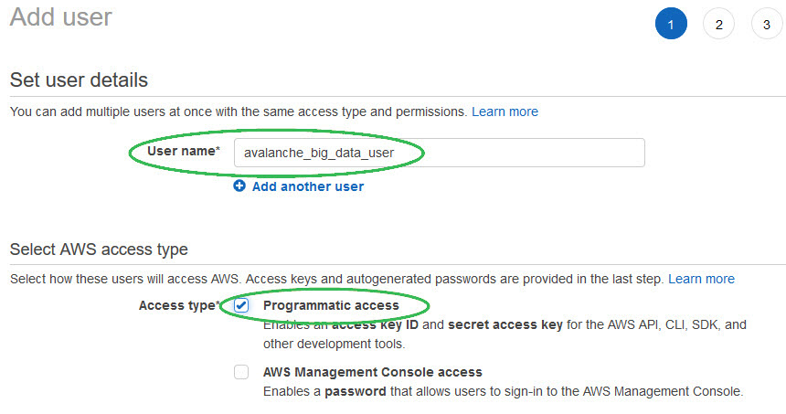
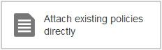
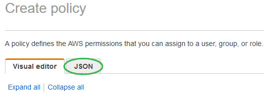
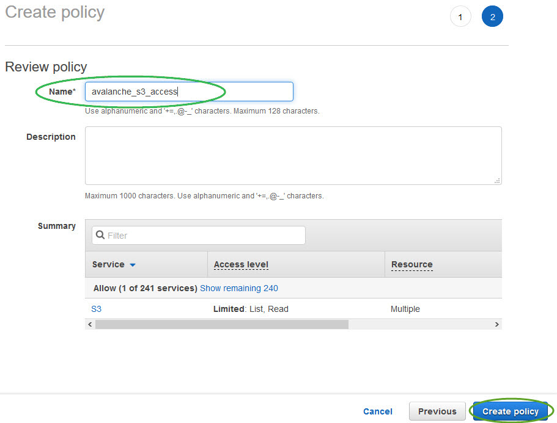
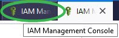
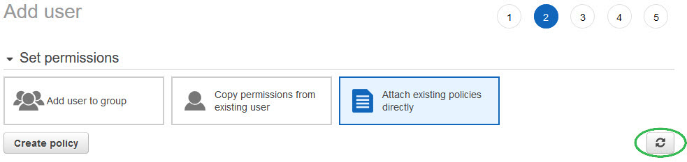
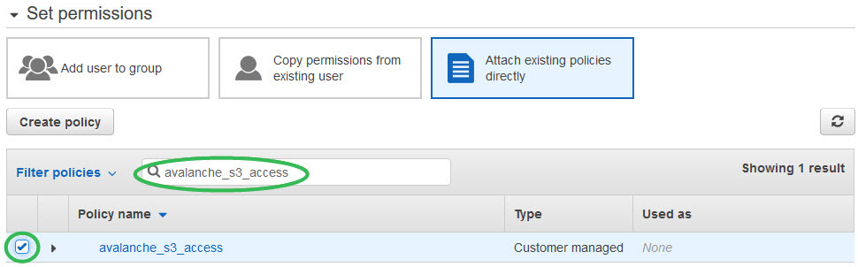
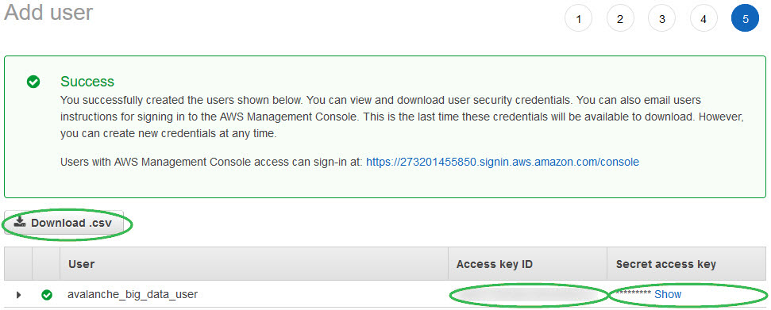

## Set Up Amazon S3 Access

One way to bulk-load data into the Actian Data Platform is to:

1. Stage it in an Amazon S3 bucket in your account.
2. Grant permissions to the Actian warehouse (through AWS IAM access keys) to enable reading from the bucket in that account.

3. Execute the relevant SQL on the Actian warehouse to read that data and store it in Actian warehouse’s native columnar format.

An S3 bucket is a uniquely named public cloud storage resource available in AWS Simple Storage Service (S3). S3 buckets are similar to file folders and store objects consisting of data and its descriptive metadata. For more information, see [Getting started with Amazon Simple Storage Service](https://docs.aws.amazon.com/AmazonS3/latest/gsg/GetStartedWithS3.html).

!!! note "Note"

    We strongly recommend that you create a separate IAM user with the relevant permissions to the S3 bucket where the source data resides. You can then generate the access keys for this IAM user and provide them to the Actian warehouse.

## Set Up Amazon S3 Access Permissions

You set up S3 access permissions in your AWS Console account. The results are access credentials (access key ID and secret access key) that you will need to set storage account authentication for a warehouse.

To set up S3 access permissions

1. Log in to the AWS Console.
2. Select IAM under the Security, Identity, & Compliance heading.



    The IAM dashboard is displayed.

3. Select Users, Add User:



4. Enter a username and give this user Programmatic access only:



5. Click Next: Permissions.
6. Select Attach existing policies directly:



7. Select Create policy:


    The Create policy page is displayed.

8. Click the JSON tab:

    

    The policy should look like the following. Replace <bucket_name> with your S3 bucket name.

```
{   "Version": "2012-10-17",   "Statement": [      {        "Effect": "Allow",        "Action": ["s3:ListBucket"                  ,"s3:GetBucketLocation"                  ],        "Resource": ["arn:aws:s3:::<bucket_name>"]      },      {        "Effect": "Allow",        "Action": [        "s3:GetObject"        ],        "Resource": ["arn:aws:s3:::<bucket_name>/*"]      }   ]}
```

9. Click Review policy:


    The Review policy pane is displayed.

10. Enter a name for the policy and select Create policy:



11. Click to return to the Create user IAM browser tab:



12. Refresh the policies:



13. Filter on the new policy and select it:



14. Click Next: Tags:


15. (Optional) Add any desired tags and then click Next: Review:


16. Review the user, then click Create user:


    The Success status is displayed.

17. Copy the Access key ID and Secret access key:



!!! note "Note"

    You will need these credentials to [Grant Access to Warehouse or Database for External Tables Access](../User/Grant_Access_to_Warehouse_or_Database_for_Extern.md).

18. Important: Download the .csv file and save for future use, as you will not have the opportunity to see the secret key again.

You may now configure your warehouse with the access key ID and secret access key to enable reading data from the S3 bucket. See [Give Your Actian Warehouse Access to AWS Cloud Storage](../User/Give_Your_Actian_Warehouse_Access_to_AWS_Cloud_S.md).

Now that you have credentials, you may use them to load data into Actian Data Platform from external tables or using the COPY VWLOAD statement. For more information, see [Cloud Object Storage Loading Methods](../DataLoading/OverviewSQLDataLoading.md).
