## Set Up Microsoft Azure Access

The Authentication mechanism that the Actian Data Platform supports to ingest data from a general-purpose v2 storage account is through Azure Active Directory using a service principal.

The instructions in this section are intended to be performed in your Azure subscription, where the source data for the Actian Data Platform is located. It is also where credentials are generated that you must supply to Actian Data Platform so that it can access and load the data.

!!! warning "Important"

    **IMPORTANT!**The steps outlined in this section can be performed only by a privileged user (typically an administrator in the Active Directory).

To give your Actian warehouse access to Azure ABFS data, you will follow these basic steps:

|  | [Step 1: Create an App Registration](../User/Set_Up_Microsoft_Azure_Access.md) |
| --- | --- |
|  | [Step 2: Obtain the Application ID and the Directory ID](../User/Set_Up_Microsoft_Azure_Access.md) |
|  | [Step 3: Assign a Scoped Role to the Application](../User/Set_Up_Microsoft_Azure_Access.md) |
|  | [Step 4: Generate a Client Secret for the Application](../User/Set_Up_Microsoft_Azure_Access.md) |

## Step 1: Create an App Registration

1. In the Azure portal, click Active Directory, App registrations:

    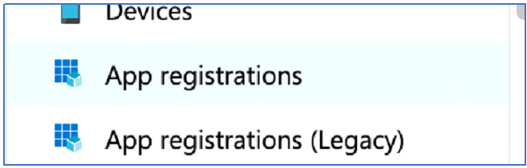

2. Click New registration:

    

    A registration form is displayed:

    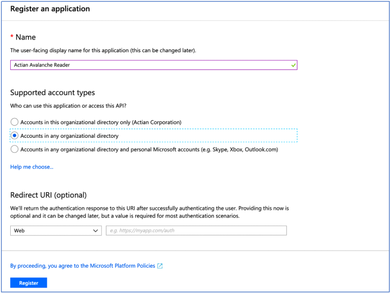

3. Assign an appropriate name.
4. Select “Accounts in any organizational directory.”

5. Leave the Redirect URI empty.
6. Click Register.

This creates the Azure AD application and shows an overview about the application. Remain on this screen and proceed to the next step.

## Step 2: Obtain the Application ID and the Directory ID

On your application overview page, make note of the Application (client) ID as well as the Directory (tenant) ID as highlighted below.

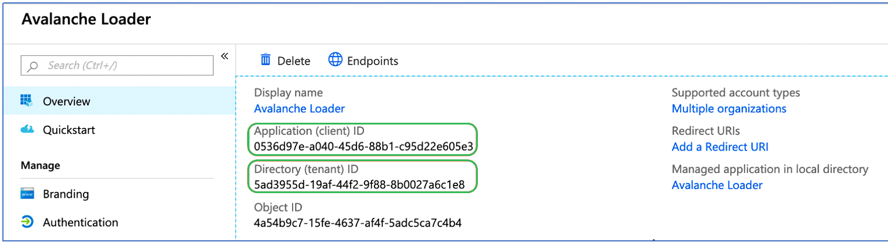

## Step 3: Assign a Scoped Role to the Application

Although the application has been created, it does not have access to any resources in any subscription in the account. In this section, you will assign to the application a Storage Blob Data Owner role scoped to the Storage Account that has the container with the source data.

1. Navigate to the Storage Account that contains the source data to be accessed and click on Access Control (IAM):

    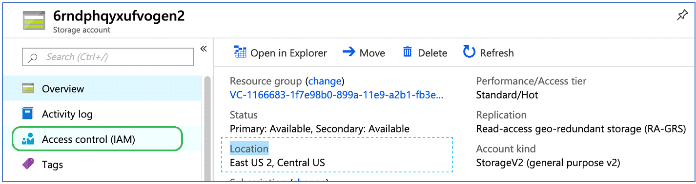

2. Click Add, Add role assignment:

    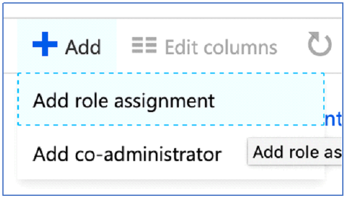

3. In the Add Role assignment window:

    a. Select the “Storage Blob Data Owner” role.

    b. Ensure that Assign access to is set to “Azure AD user, group, or service principal.”

    c. Enter the name of the app created earlier in Step 1 (for example, Actian Reader):

    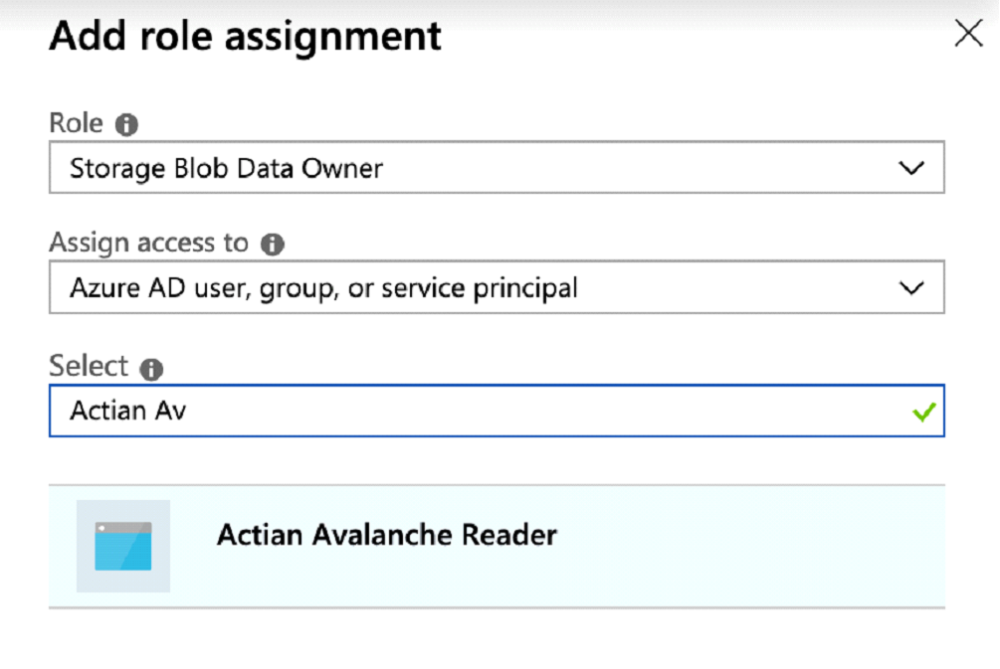

4. Select the app and then click Save.

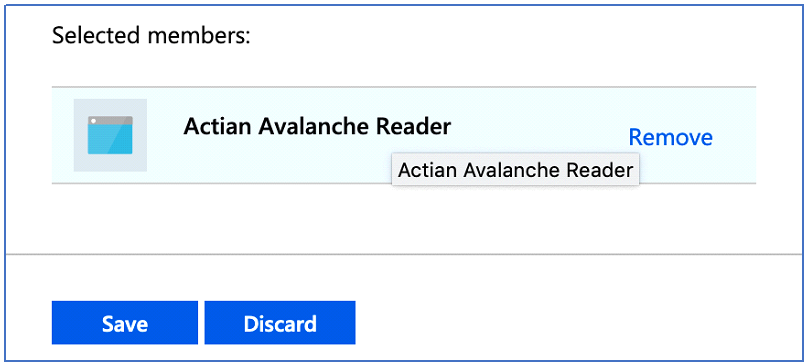

## Step 4: Generate a Client Secret for the Application

The Azure AD application is now in place and has read-only access to the Storage Account that contains the data that Actian Data Platform needs access to. The last step is to generate the secret (password) for this application that you must provide to Actian Data Platform so that it can access the data.

1. Navigate to Azure Active Directory, App registrations, Actian Reader app, and click on Certificates & secrets:

    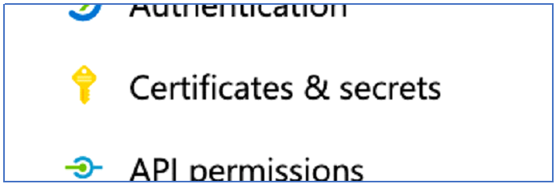

2. Click New client secret:

    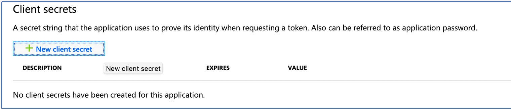

3. Provide a description for the secret and click Add:

    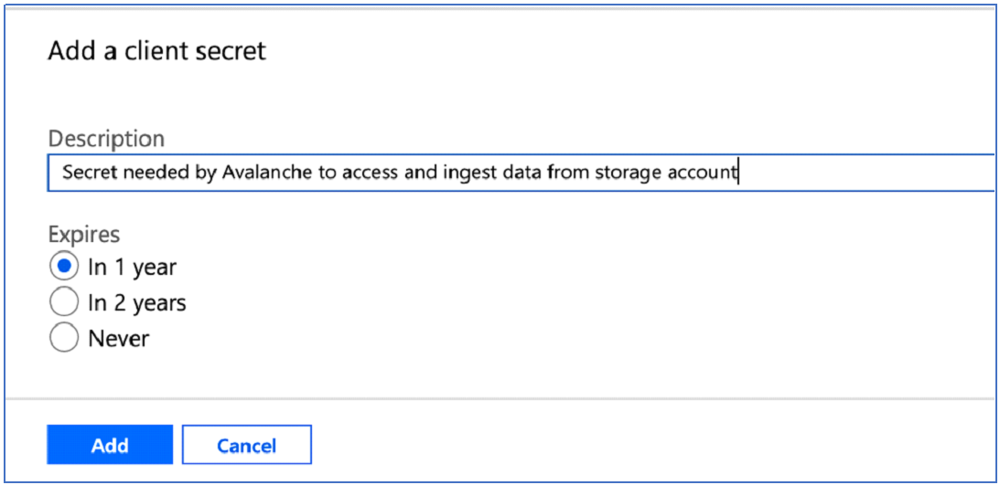

4. Important: Copy the value of the secret (this is the only time it will be displayed):

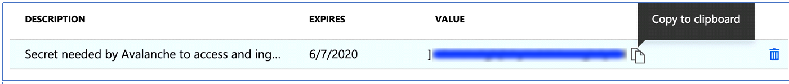

You have set up an Azure AD application successfully with a service principal and assigned it access to a storage account from where you will read and load your data through an external table.

You may now configure your warehouse with the application (client) directory (tenant) IDs to enable reading data from Azure storage. See [Give Your Actian Warehouse Access to Azure Cloud Storage](../User/Give_Your_Actian_Warehouse_Access_to_Azure_Cloud.md).

Now that you have credentials, you may use them to load data into the Actian Data Platform from external tables or using the COPY VWLOAD statement. For more information, see [Cloud Object Storage Loading Methods](../DataLoading/OverviewSQLDataLoading.md).
