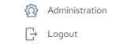
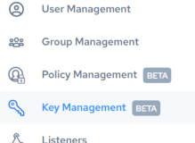
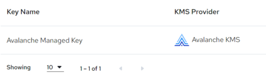
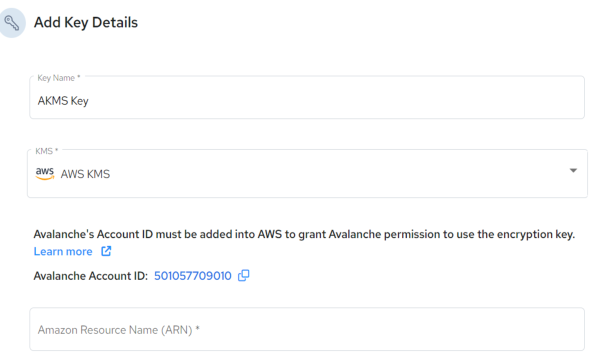
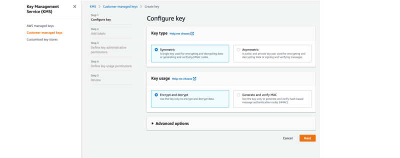
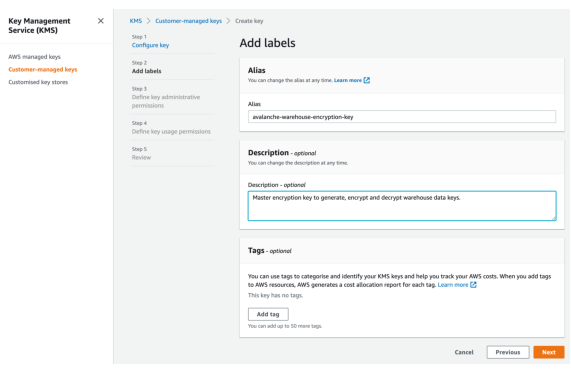

## Set Up the AWS Key Management Service (AKMS)

To enable an AKMS for data encryption, you must:

1. Initiate adding an access key in the Actian Data Platform
2. Create a symmetric key in AWS

3. Complete your access key in the Actian Data Platform
4. Select your AWS-managed key for encryption when creating warehouse

## Add an access key in the Actian Data Platform

1. In the Actian Data Platform console, click your user ID in the upper right corner of the browser and select Administration from the dropdown menu:



2. In the navigation pane on the left, click Key Management:



    The Key Management panel is displayed:



    If you have created no warehouses or any key aliases, “No Encryption Key” will be displayed for the default Actian-managed encryption as well as the AWS Key Management Service.

3. Click the  Add New button.

    The Add Key Details dialog opens:

4. Add a Key Name, specify AWS KMS, and copy the Actian Data Platform Account ID to add the Actian Data Platform account ID to your AKMS policy.
5. [Add the Actian Data Platform AWS Account ID to Your AKMS Policy](../User/Set_Up_the_AWS_Key_Management_Service_(AKMS).md). After you finish this task in AWS, return back to the Actian Data Platform to finish creating and validating key.

6. Add the Amazon Resource Name (ARN) generated from AWS. The ARN and corresponding region are mandatory for requests that the AKMS makes on your behalf. If you enter an incorrect region, your key connection validation will fail. Warehouse regions are independent of the KMS master key ID’s region of origin.
7. Validate key before using to create your warehouse.

After you create a warehouse, this key alias will be displayed in the Encryption Key field of the [Warehouse Details](../User/Warehouse_Details.md) page.

## Add the Actian Data Platform AWS Account ID to Your AKMS Policy

To add the Actian Data Platform AWS account ID to your AKMS policy

1. Sign into the AWS Management Console and open the AKMS (https://console.aws.amazon.com/kms) and select Customer managed keys.

Note: If you need to change the AWS Region, use the Region selector in the upper-right.

2. Choose Create key.
3. Choose Symmetric for Key type, verify the Encrypt and decrypt option selection, and click Next.

4. Create an alias for the KMS key and add a description, if necessary.
5. (Optional) Type a tag key and an optional tag value and click Next.

6. (Optional) Select the IAM users and roles that can administer the KMS key.
7. (Optional) To prevent the selected IAM users and roles from deleting this KMS key, in the Key deletion section at the bottom of the page, clear the Allow key administrators to delete this key check box and click Next.

8. [(Optional) Select the IAM users and roles that can use the key in cryptographic operations.](https://docs.aws.amazon.com/kms/latest/developerguide/concepts.html#cryptographic-operations)
9. Allow the Actian Data Platform AWS account to use this KMS key for cryptographic operations. To do so, in the Other AWS accounts section at the bottom of the page, choose Add another AWS account and enter the AWS account identification number of the Actian Data Platform AWS account.

10. Add the Actian Data Platform account ID from the Add Access Key dialog.
11. (Optional) You can verify that the account ID has been added to your KMS policy. It should contain something like this:

```
"Principal": {"AWS": [ "arn:aws:iam::your_account_id:user/user_name", "arn:aws:iam::123456789012:root" ]
```
