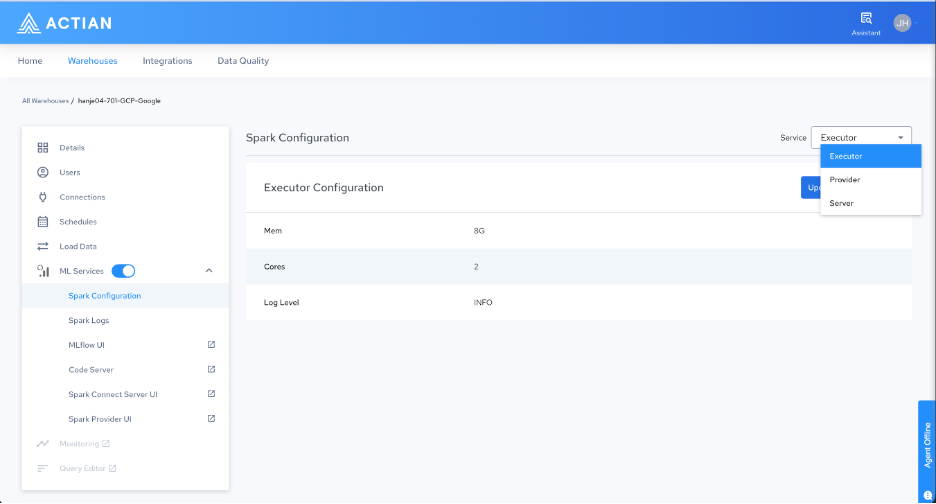

## Spark Configuration

The Spark Configuration page lets you tune resource allocation for each of the three Spark service components. Use the Service drop-down menu in the upper-right corner of the page to switch between the Executor, Provider, and Server configuration views.

When ML services are enabled, you can configure the following two Spark deployments:

    - Spark Connect Server: The customer-facing deployment, which is accessible from outside the platform through scripting and Spark SQL.

    - Spark Provider: This deployment handles external table processing and Scala UDFs. When ML services are disabled, the Spark Provider runs on a default configuration that you cannot modify through the UI. The Spark Provider is always available independent of the Spark Connect Server because it is required by the analytics engine, and it is excluded from additional cost calculations.

The Service drop-down menu targets map to the following components:

| Service target | Description |
| --- | --- |
| Executor | Resources for each Spark executor pod.**Note:**The executor configuration Cores, Mem, and Log Level is applied uniformly to executors started by both the Provider and the Server. |
| Provider | Resource defaults for the Spark Provider pod (cores, memory, and log level). |
| Server | Resource defaults for the Spark Connect Server pod (cores, memory, and log level). |

The configurable parameters are as follows:

| Parameter | Description |
| --- | --- |
| Mem | Main memory for the pod or executor in GB. For example, 8GB. |
| Cores | Number of vCPU cores. |
| Log Level | Spark log, INFO (default), DEBUG, WARN, or ERROR. |

To modify executor resources, select Executor from the Service drop-down menu, and then select Update Configuration. The default executor configuration is 8 GB of memory, 2 cores, and the INFO log level.

### Resource Sizing

Use the following recommendations for sizing executor resources:

| Workload size | Data volume | Recommended configuration |
| --- | --- | --- |
| Small | Less than 10 GB | 2 vCores, 8 GB RAM per executor (default) |
| Medium | 10–100 GB | 4 vCores, 16 GB RAM per executor |
| Large | Greater than 100 GB | 8 vCores, 64 GB RAM per executor (1 AU) |

!!! warning "Important"

    **IMPORTANT!**Billing is based on requested resources, not actual usage. Right-size your executor configuration to manage costs.
