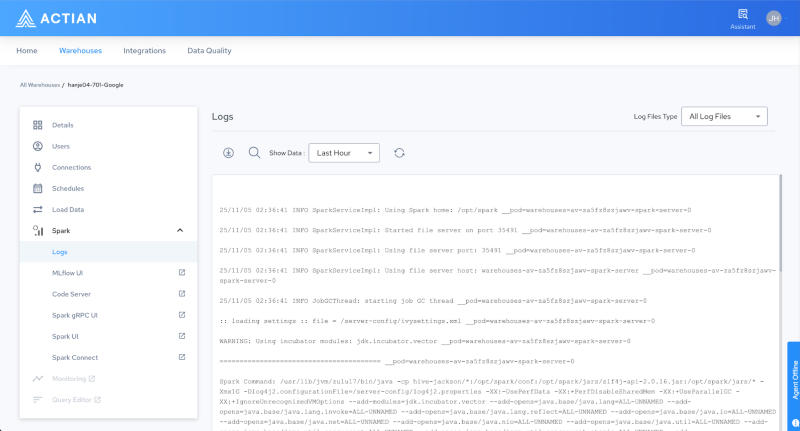

## Spark Logs

The Spark Logs page displays live and historical log output from all Spark components. You can filter logs by component Server, Provider, or Executor and by time range. Use this page to diagnose job failures, out-of-memory errors, and configuration issues.
