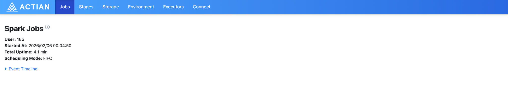

## Spark Provider UI

The Spark Provider UI is a monitoring interface that displays execution details for Spark jobs running through the Spark Provider.

| Capability | Description |
| --- | --- |
| Job execution view | Displays all executed items and their current status. |
| Execution plans | Shows the logical and physical plans for each Spark job. |
| Plan metrics | Shows the metrics associated with each execution plan. |
| Troubleshooting data | Surfaces diagnostic details, such as out-of-memory errors, task counts, and other issues encountered during execution. |

!!! note "Note"

    Use this UI alongside Spark Logs and the Spark Connect Server UI to monitor, experiment with, and debug your Spark jobs.
