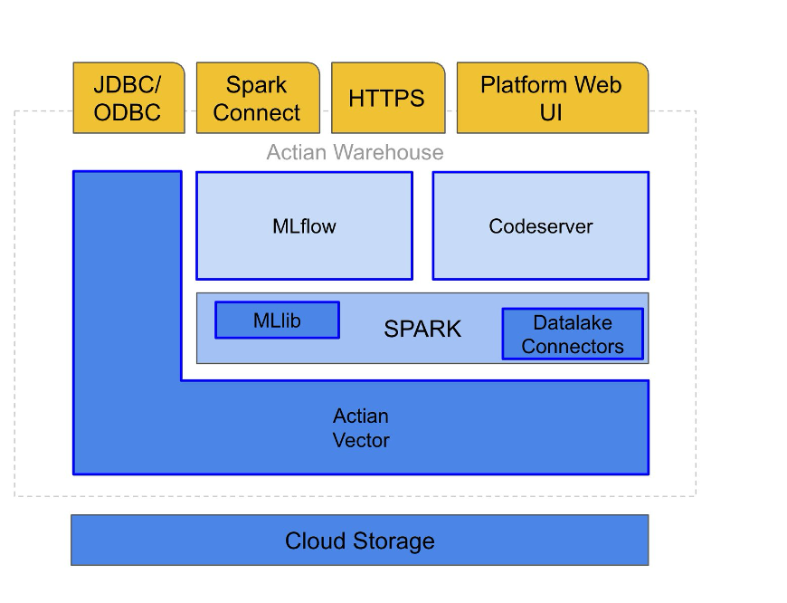

## System Architecture

The Sparkforce platform uses a layered architecture. The system is organized from the foundation upward to ensure efficient data persistence and application delivery:

    - Infrastructure: Sparkforce operates on top of cloud storage and tightly integrates with the existing Actian Analytics Engine, which is still accessible via JDBC/ODBC. The integration comprises a catalog API for querying tables in the Analytics Engine directly from Spark SQL, operator push-down from Spark to the Analytics Engine for performance optimization, and a proprietary binary protocol for high-speed data communication between Spark and the Analytics Engine.

    - Communication: All connections are TLS-secured and authenticated by using bearer tokens. Spark Connect uses gRPC over HTTP/2

    - Dynamic deployment: The Spark deployment is dynamic, executor pods start only when a job is triggered and shut down when the job is complete.

