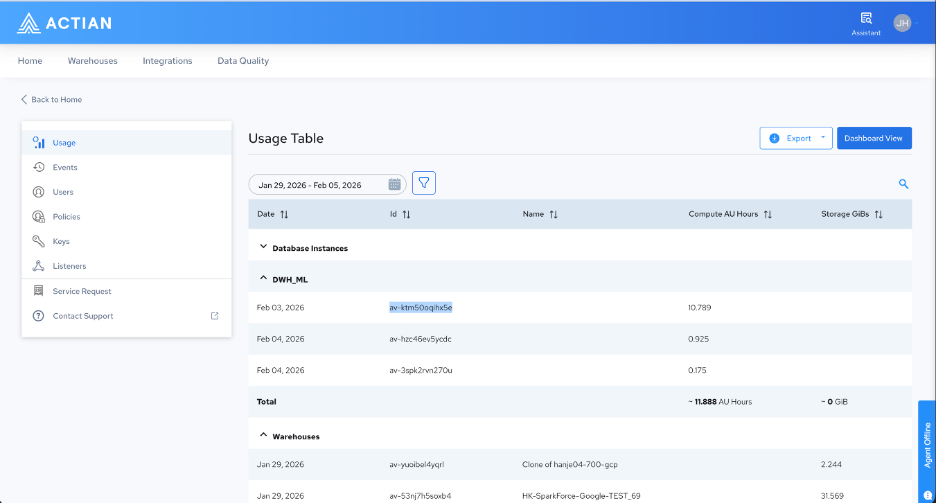

## Usage and Billing

Administrators can view compute and storage consumption across all warehouses in the Admin Console at [console.dev.actiandataplatform.com/admin/usage](https://docs.actian.com/actiandataplatform/User/Actian_Data_Platform_Warehouses_Console.md). The Usage table groups consumption by database instances and warehouses, displaying compute AU hours and storage gibibytes (GiB) per warehouse ID per day. You can export this data or view it in a dashboard format.

Spark ML consumption is reported separately from standard warehouse compute under the DWH_ML label. This separation allows administrators to distinguish Spark job costs from general warehouse costs at a glance.

!!! warning "Important"

    **IMPORTANT!**The AU hours displayed under DWH_ML reflect the requested resources per job, calculated as cores × memory × runtime duration, not the peak actual utilization. Because jobs are metered individually, the DWH_ML total represents the sum of all Spark job costs within the selected period. Right-sizing your executor configuration for each workload is the most effective way to manage these costs.
