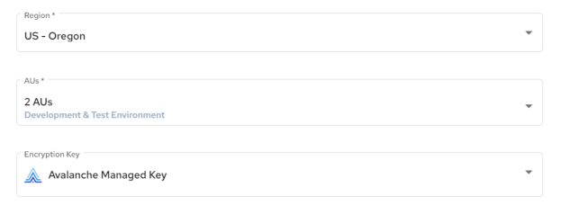

## Using an Actian-managed Encryption Key

If you do not create an external customer-managed KMS, the default Actian-managed encryption key can set up and create a warehouse. The Actian-managed encryption key acts as your own exclusive master key ID within the Actian Data Platform.

You can see the use of the Actian-managed encryption key on the [Warehouse Details](../User/Warehouse_Details.md) page:

Warehouses you create can use the default Actian-managed encryption key until you set up your own key alias that uses your external KMS. For instructions, see [Set Up the AWS Key Management Service (AKMS)](../User/Set_Up_the_AWS_Key_Management_Service_(AKMS).md).
