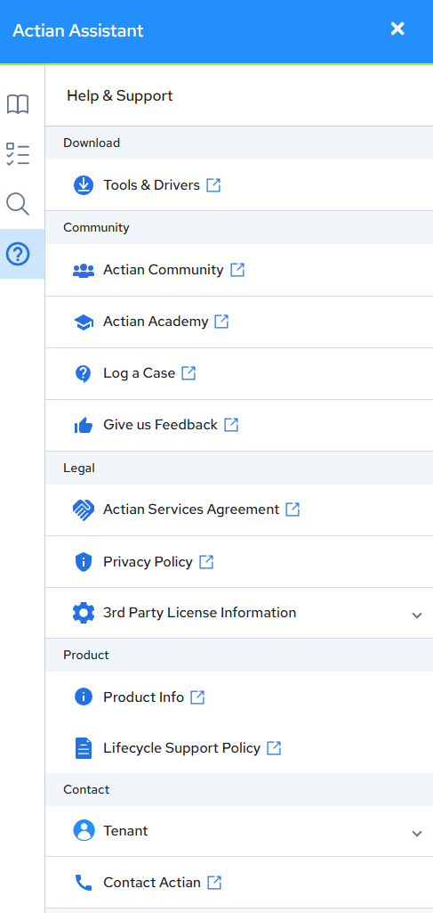

## Using the Actian Assistant

After logging in, you can display the Actian Data Platform online documentation or jump to the Actian Community for help using the Actian Assistant available from the Actian Data Platform.

To open the Actian Assistant

Click this icon to the right of your username in the header bar:

The Actian Assistant opens a pane on the right side of the web console. It contains a menu bar on the left side with these options:

**Resources**

:   Contains links to Actian Academy videos, Community articles, and documentation topics.

**Recommended Tasks**

:   Displays beginning tasks based on your onboarding survey answers. The tasks list is divided into tasks not tried yet and those you have completed.

**Recommended Tasks**

:   Displays beginning tasks based on your onboarding survey answers. The tasks list is divided into tasks not tried yet and those you have completed.

**Search Resources**

:   You can search indexed.

**Actian Community**

:   Displays Actian Community activities:

    - Recommended articles from the Actian Community

    - My Questions you will post or have posted to gather responses from the support team and other Actian Data Platform users

    - Followed displays conversations you are following and have responded to

:   To open the Actian Community page in a new browser window, click this icon: 

**Help from the Actian Community**

:   The Actian Community is a 24x7 online support application for Actian Community users. Community users can search the Actian Knowledge Base and forums to obtain help. You also may participate in our community and recommend improvements to our software through the Idea Center. Access the online system at [https://communities.actian.com](https://communities.actian.com).

**What’s New**

:   Opens the Integrations dashboard with the “News & Announcements” RSS feel from the Actian Corporation blog (actian.com/feed).

To search the contents of the assistant, click the search icon in the assistant’s title bar.
