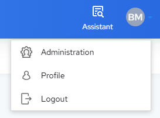

# Warehouse Administration

!!! note "Note"

    This section is for users with Account Administrator access to an Actian Data Platform account. For more information, see [Manage Users](../User/Manage_Users.md).

!!! warning "Important"

    **IMPORTANT!**Beginning with the January 2022 release, user access to the Actian Data Platform has changed. If you were not previously an Account Administrator, you can still log in but will have no access to warehouses or other features. (Your user status defaults to No Role.)

    If you receive the following message, contact your Account Administrator to assign you the role of Warehouse User or Warehouse Administrator (see [Manage Users](../User/Manage_Users.md)):

     Service Unavailable 403 Insufficient privilege to perform requested operation.
    After your Account Administrator assigns a role to you, you must log out of the console and log back in to enable your new role assignment (see [Log Out](../User/Log_Out.md) and [Log In](../User/Log_In.md)).

To open the Administration interface

1. In the upper right corner of the Actian Data Platform console window, click the user menu and select Administration:

    

    The Administration interface opens in a new browser tab.

2. In the pane on the left, click the option you want to manage.

    The corresponding page is displayed on the right.

For more information about monitoring account AU usage, see [Monitor AU Usage](../User/Monitor_AU_Usage.md).
